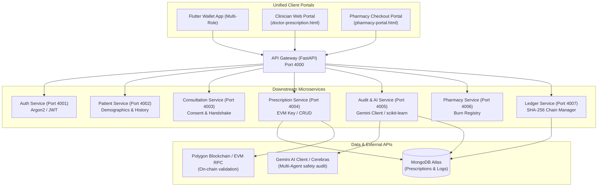
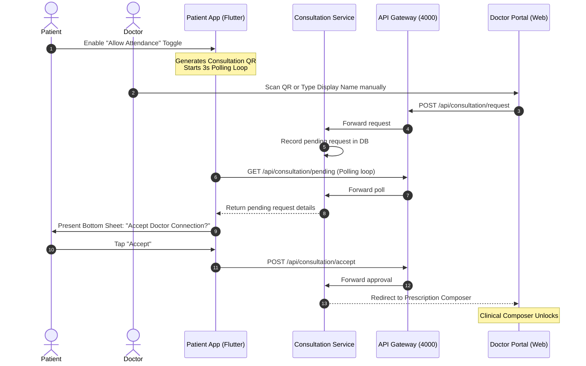
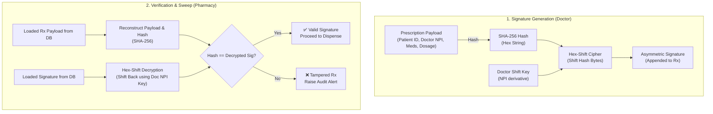

# 🛡️ AegisRx (HealthLock) — Sovereign Patient Health Wallet

AegisRx is a zero-trust, decentralized patient health wallet and clinical microservices suite. It shifts the ownership of clinical data from centralized hospital systems directly to the **patient as the sovereign custodian** of their own medical records, prescriptions, and access permissions.

---

## 🎯 Architecture Pillars

AegisRx is built upon four architectural pillars designed to ensure zero-trust security, clinical accuracy, and cryptographic data integrity:

```
  ┌─────────────────────────────────────────────────────────────┐
  │                    1. ZERO-TRUST CONSENT                    │
  │  Doctors cannot access patient history or write prescriptions │
  │  without explicit scanning and approval of a session token.  │
  └──────────────────────────────┬──────────────────────────────┘
                                 ▼
  ┌─────────────────────────────────────────────────────────────┐
  │              2. CRYPTOGRAPHIC TAMPER-PROOFING               │
  │  Prescriptions are hashed with SHA-256 and signed with the  │
  │  physician's NPI-keyed signature. Checks validation at desk.│
  └──────────────────────────────┬──────────────────────────────┘
                                 ▼
  ┌─────────────────────────────────────────────────────────────┐
  │                 3. AI CLINICAL SAFETY NET                  │
  │  Real-time drug-drug and drug-allergy interaction checking  │
  │  powered by Gemini Multi-Agent AI + IsolationForest anomaly  │
  │  detection for prescription outliers.                       │
  └──────────────────────────────┬──────────────────────────────┘
                                 ▼
  ┌─────────────────────────────────────────────────────────────┐
  │             4. IMMUTABLE ACTIVITY LEDGER LOGS               │
  │  All access, creation, and dispensation logs are chained     │
  │  chronologically with SHA-256 hashes, stored in MongoDB.    │
  └─────────────────────────────────────────────────────────────┘
```

---

## 🏗️ System Architecture & Data Flow

AegisRx integrates Patient, Doctor, and Pharmacist workflows into a native, high-performance Flutter mobile/desktop app communicating with a central FastAPI API Gateway which coordinates 8 microservices:



---

## 🔄 Core System Workflows

### 1. Zero-Trust Consent Handshake

Before a doctor can view history or submit prescriptions, a peer-to-peer session must be authorized by the patient.



### 2. Cryptographic Verification & Sovereign Signatures

To prevent tampered prescriptions, AegisRx does not store simple editable text. It uses an asymmetric signature scheme where the doctor's NPI is used as a deterministic key shift over the SHA-256 payload digest.



---

## 🛠️ Complete Technology Stack

| Layer | Technology | Purpose |
| :--- | :--- | :--- |
| **Frontend Mobile App** | **Flutter 3.10+ (Dart)** | Unified Multi-Role Client (Patient Wallet, Doctor Console, Pharmacy scan fallback) |
| **Backend Microservices** | **FastAPI (Python 3.11+)** | Core backend running 8 isolated services communicating via an API Gateway |
| **AI Inference Engine** | **Gemini AI API / Cerebras** | Multi-Agent AI system running clinical safety checks and generating recommendations |
| **Outlier Detection** | **scikit-learn (Isolation Forest)** | Identifies statistical anomalies in physician prescription frequency |
| **Database Document Store** | **MongoDB Atlas** | Live patient details, allergies, prescriptions, and chained event logs |
| **Tamper-Proofing** | **SHA-256 & Hex-Shift** | Lightweight, deterministic cryptographic asymmetric signing algorithm |
| **On-Chain Validation** | **Polygon Blockchain (EVM)** | Anchors transactional state checks to public ledger if configured |

---

## 📡 Microservices Port & Registry

The backend contains 8 microservices coordinate under an isolated model:

| Service Name | Port | Path | Primary Responsibilities |
| :--- | :--- | :--- | :--- |
| **Gateway Service** | `4000` | `/` | Central proxy router, CORS provider, request ID tracing |
| **Auth Service** | `4001` | `/api/auth` | User account login, password hashing via Argon2, token verification |
| **Patient Service** | `4002` | `/api/patient` | Retrieves patient profiles, histories, and allergy lists from MongoDB |
| **Consultation Service**| `4003` | `/api/consultation` | Manages doctor connection requests, approvals, and live polling sessions |
| **Prescription Service**| `4004` | `/api/prescriptions`| Generates, signs, and reads patient prescriptions; interfaces with Polygon RPC |
| **Audit Service (AI)** | `4005` | `/api/audit` | Executes duplicate sweeps, allergy check, LLM interactions, and Isolation Forest |
| **Pharmacy Service** | `4006` | `/api/pharmacy` | Validates prescription hash integrity and handles the token-burn dispensing flow |
| **Ledger Service** | `4007` | `/api/ledger` | Main chain manager compiling sequential SHA-256 blocks of system activities |

---

## 📁 Codebase Directory Structure

Explore the main modules of the codebase (links point to local workspace files):

* 📱 [**lib/**](file:///c:/Users/srima/hackathon%20votexa/health_lock/lib): Flutter Mobile & Desktop Client Application
  * [main.dart](file:///c:/Users/srima/hackathon%20votexa/health_lock/lib/main.dart): App launch entry point, initializes SimulationState.
  * [core/theme/app_theme.dart](file:///c:/Users/srima/hackathon%20votexa/health_lock/lib/core/theme/app_theme.dart): Neon-ambient theme styling, card gradients, and typography.
  * [core/state/app_state.dart](file:///c:/Users/srima/hackathon%20votexa/health_lock/lib/core/state/app_state.dart): Master state manager coordinating polling loops, local security PINs, and REST API calls.
  * [core/crypto/crypto_helper.dart](file:///c:/Users/srima/hackathon%20votexa/health_lock/lib/core/crypto/crypto_helper.dart): Hashing utilities on the Flutter client.
  * **features/patient/screens/**:
    * [patient_dashboard_screen.dart](file:///c:/Users/srima/hackathon%20votexa/health_lock/lib/features/patient/screens/main_screen_patient/patient_dashboard_screen.dart): Patient dashboard displaying health cards, wallet balances, and logs.
    * [patient_settings_screen.dart](file:///c:/Users/srima/hackathon%20votexa/health_lock/lib/features/patient/screens/main_screen_patient/patient_settings_screen.dart): Sovereign Profile setup, custom server config endpoints.
    * [patient_share_screen.dart](file:///c:/Users/srima/hackathon%20votexa/health_lock/lib/features/patient/screens/patient_share_screen.dart): Generates secure QR tokens for clinical sessions.
  * **features/doctor/screens/**:
    * [doctor_prescription_editor_screen.dart](file:///c:/Users/srima/hackathon%20votexa/health_lock/lib/features/doctor/screens/doctor_prescription_editor_screen.dart): Clinician Composer with interactive drug inputs and override triggers.
    * [doctor_ai_audit_result_screen.dart](file:///c:/Users/srima/hackathon%20votexa/health_lock/lib/features/doctor/screens/doctor_ai_audit_result_screen.dart): Safety reports outlining risk bands, allergy matches, and alternative recommendation cards.
    * [doctor_override_and_sign_screen.dart](file:///c:/Users/srima/hackathon%20votexa/health_lock/lib/features/doctor/screens/doctor_override_and_sign_screen.dart): Verification console displaying NPI signatures, EVM commits, and final signs.
  * **features/pharmacy/screens/**:
    * [pharmacy_verification_screen.dart](file:///c:/Users/srima/hackathon%20votexa/health_lock/lib/features/pharmacy/screens/pharmacy_verification_screen.dart): Decrypts doctor signature offsets and compares them to calculated SHA-256 hashes.
    * [pharmacy_dispense_screen.dart](file:///c:/Users/srima/hackathon%20votexa/health_lock/lib/features/pharmacy/screens/pharmacy_dispense_screen.dart): Final verification desk, updates token state to dispensed (burned).

* ⚙️ [**backend-ai/**](file:///c:/Users/srima/hackathon%20votexa/health_lock/backend-ai): FastAPI Microservices Backend
  * [start_local.py](file:///c:/Users/srima/hackathon%20votexa/health_lock/backend-ai/start_local.py): Dev launcher starting all 8 microservices as standalone subprocesses.
  * **services/**: Isolated service directories housing Pydantic models, routers, and business logic.
    * [audit-service/app/ai/services/ai_service.py](file:///c:/Users/srima/hackathon%20votexa/health_lock/backend-ai/services/audit-service/app/ai/services/ai_service.py): Multi-agent safety checks (RxNorm/DrugBank/DailyMed) and LLM wrappers.
    * [prescription-service/app/utils/signature.py](file:///c:/Users/srima/hackathon%20votexa/health_lock/backend-ai/services/prescription-service/app/utils/signature.py): Secure hash calculation and Hex-Shift cipher algorithms.
  * [public/](file:///c:/Users/srima/hackathon%20votexa/health_lock/backend-ai/public): HTML5 practitioner and pharmacy web panels.
    * [doctor-prescription.html](file:///c:/Users/srima/hackathon%20votexa/health_lock/backend-ai/public/doctor-prescription.html): Practitioner Web interface with pre-flight audits.
    * [pharmacy-portal.html](file:///c:/Users/srima/hackathon%20votexa/health_lock/backend-ai/public/pharmacy-portal.html): Verification dashboard for pharmacists.

---

## 🧪 Mock Gaps vs. Production Verification

To facilitate smooth sandbox evaluations, AegisRx contains isolated mock behaviors that map to production services:

| Component / Flow | Mock Sandbox Fallback (Dev Mode) | Production System Target (Prod Mode) |
| :--- | :--- | :--- |
| **Patient Profile** | Starts with guest state `Elena Vance` and ID `992818` | Queries authenticated user details from MongoDB Patient Collection |
| **JWT Tokens** | Offline guest mode issues hardcoded tokens | Auth service issues Argon2 cryptographically verified token strings |
| **ID Documents** | Auto-mock upload logs `id_proof_document_aadhaar.pdf` | Uploads binary files to AWS S3/Cloud Storage buckets via `/api/media/upload` |
| **Safety Auditing** | Rule-engine fallbacks (e.g. penicillin triggers 95 risk) | Multi-agent Gemini AI models parse patient context live via API |
| **Practitioner Keys** | Generate offline signature hashes if EVM node is blank | Commits transaction hash onto Polygon network via RPC endpoint |

---

## 🚀 Getting Started & Execution

Follow these steps to run the complete AegisRx system locally on Windows:

### Step 1: Environment Setup
1. Navigate to the `backend-ai/` directory.
2. Duplicate `.env.example` as `.env`.
3. Configure your MongoDB Atlas URL and Gemini AI API Key:
   ```ini
   MONGODB_URI=mongodb+srv://<user>:<password>@<cluster>.mongodb.net/?appName=cluster0
   MONGODB_DATABASE=healthcare_db
   GEMINI_API_KEY=AIzaSy...
   RUN_DB_SEED_ON_STARTUP=true
   ```

### Step 2: Start All Backend Services
We provide a local dev launcher that starts all 8 services in isolated subprocesses on their designated ports:
```powershell
cd backend-ai
python -m venv venv
.\venv\Scripts\activate
pip install -r requirements.txt
python start_local.py
```
> [!NOTE]
> Setting `RUN_DB_SEED_ON_STARTUP=true` in `.env` automatically populates patient allergies, doctor records, and historical prescriptions into your MongoDB database on startup.

### Step 3: Run the Flutter Client
Return to the repository root directory and run the Flutter client:
```powershell
# Return to the root folder
flutter pub get
flutter run
```

---

## 🔬 End-to-End Demo Walkthrough Scenario

Experience the full zero-trust, patient-sovereign workflow:

1. **Log in as Patient**: Open the Flutter app, select **Patient Portal**, choose Guest or Email login. In Settings, enable **Allow Doctor Attendance** to generate a Consultation QR code.
2. **Access Handshake**: Open the practitioner login at `http://127.0.0.1:4000/doctor-login.html`. Log in with a practitioner ID, and scan or manually enter the Patient's display name. Submit the request.
3. **App Consent Approval**: The patient's Flutter dashboard will immediately show a notification bottom card. Tap **Accept** to approve the clinician connection.
4. **AI Pre-flight Audit**: The doctor's web composer unlocks. Enter a diagnosis (e.g. `Infection`) and choose a medication (e.g. `Penicillin`). Click **Run Pre-flight Clinical Audit**. The AI safety engine alerts you to any allergies (like penicillin allergy seeded in mock DB) and recommends safe alternatives.
5. **Sovereign Signature**: Modify the prescription as required. Click **Submit & Cryptographically Sign**. The server computes a SHA-256 hash, shifts the hex value according to the doctor's deterministic shift offset, and writes the prescription to MongoDB and the sequential ledger.
6. **Pharmacy Verification**: Tap the prescription inside the Patient App vault to display the checkout QR code. Open the Pharmacy Desk web portal at `http://127.0.0.1:4000/pharmacy-portal.html`, enter the Prescription ID, and click **Run Verification & Sweep Checksum**. The pharmacy client reconstructs the JSON, calculates the hash, reverses the shift using the doctor's key, and confirms signature validity.
7. **Token Burn**: Tap **Dispense Medications** to mark `isDispensed` to `true` in MongoDB, locking the token from future dispenses.
