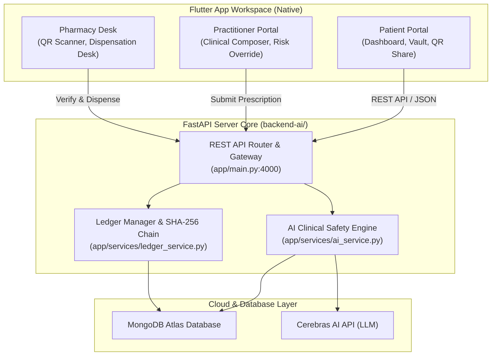
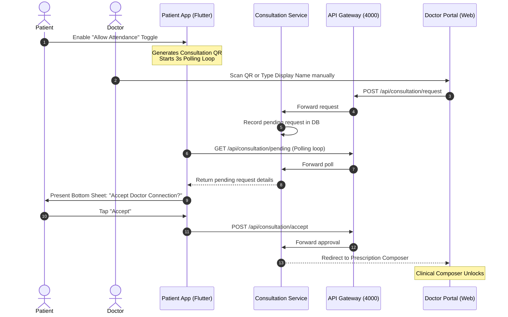
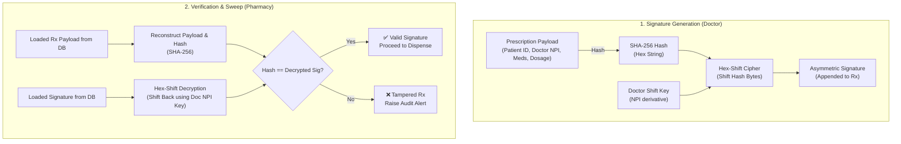

# 🛡️ AegisRx — Sovereign Patient Health Wallet

AegisRx is a zero-trust, decentralized patient health wallet and clinician suite. It shifts the ownership of clinical data from centralized hospital systems directly to the **patient as the sovereign custodian** of their own medical records, prescriptions, and access permissions.

---

## 📋 Project Overview

<<<<<<< Updated upstream
AegisRx is built upon four architectural pillars designed to ensure zero-trust security, clinical accuracy, and cryptographic data integrity:

```
  ┌─────────────────────────────────────────────────────────────┐
  │                    1. ZERO-TRUST CONSENT                    │
  │  Doctors cannot access patient history or write prescriptions │
  │  without explicit scanning and approval of a session token.  │
  └──────────────────────────────┬──────────────────────────────┘
                                 ▼
  ┌─────────────────────────────────────────────────────────────┐
  │              2. CRYPTOGRAPHIC TAMPER-PROOFING               │
  │  Prescriptions are hashed with SHA-256 and signed with the  │
  │  physician's NPI-keyed signature. Checks validation at desk.│
  └──────────────────────────────┬──────────────────────────────┘
                                 ▼
  ┌─────────────────────────────────────────────────────────────┐
  │                 3. AI CLINICAL SAFETY NET                  │
  │  Real-time drug-drug and drug-allergy interaction checking  │
  │  powered by Cerebras LLM + IsolationForest anomalies.       │
  └──────────────────────────────┬──────────────────────────────┘
                                 ▼
  ┌─────────────────────────────────────────────────────────────┐
  │             4. IMMUTABLE ACTIVITY LEDGER LOGS               │
  │  All access, creation, and dispensation logs are chained     │
  │  chronologically with SHA-256, stored in MongoDB Atlas.     │
  └─────────────────────────────────────────────────────────────┘
```
=======
AegisRx (HealthLock) is a comprehensive, production-ready, peer-to-peer digital healthcare ecosystem designed for high-security clinical environments. It integrates a native, high-fidelity Flutter mobile application (for patients) with modern web portals (for doctors and pharmacists) and a FastAPI-based microservices backend. By establishing a zero-trust handshake protocol and cryptographic tamper-proofing, AegisRx guarantees that patients remain the sole owners and managers of their healthcare data.
>>>>>>> Stashed changes

---

## ⚠️ Problem Statement

<<<<<<< Updated upstream
AegisRx integrates Patient, Doctor, and Pharmacist workflows into a native, high-performance Flutter mobile/desktop app communicating with a central FastAPI backend:
=======
Traditional healthcare information systems are highly centralized, fragmented, and insecure, presenting several critical issues:
1. **Lack of Patient Consent**: Patients have zero visibility or real-time control over who views, edits, or transfers their medical records.
2. **Prescription Fraud & Tampering**: Digital and paper prescriptions are easily forged, altered, or double-dispensed, contributing to drug abuse and pharmacy audit failures.
3. **Clinical Safety Gaps**: Real-time evaluations of drug-drug interactions and patient allergies are rarely done pre-flight at the point of care, leading to preventable adverse events.
4. **Retroactive Log Alterations**: Standard healthcare databases lack cryptographic immutability, meaning access logs can be altered or erased retroactively by administrators or bad actors.

---

## 💡 Solution Description

AegisRx addresses these issues by rebuilding clinical workflows on top of zero-trust security and decentralization:
* **Patient-Sovereign Storage**: Health records, prescriptions, and logs are tied cryptographically to the patient's unique Sovereign ID.
* **Consent Handshake**: Doctors cannot search, read, or prescribe to a patient without scanning a session token and receiving real-time patient approval on their device.
* **Hex-Shift Sovereign Signatures**: Prescriptions are canonicalized, hashed with SHA-256, and cryptographically signed using a deterministic shift offset derived from the doctor's NPI.
* **Multi-Agent AI Safety Net**: A hybrid clinical auditor queries Gemini AI and clinical rules (RxNorm, DrugBank) to check for drug-drug interactions, duplicates, and allergies, combined with an Isolation Forest outlier detector for doctor prescription habits.
* **Chained Activity Ledger**: Every access grant, prescription creation, and pharmacy dispensation is compiled into sequential SHA-256 hashed blocks, forming an immutable ledger.

---

## ✨ Features

### 📱 Patient Sovereign Wallet (Flutter Client)
* **Secure Biometric/PIN Lock**: Restricts local wallet access with custom PIN hashes.
* **Consultation Handshake Panel**: Displays real-time polling cards for pending connection requests from clinicians.
* **Vault Ledger Logs**: Displays a real-time, chronological view of the patient's activity audit chain.
* **Prescription Wallet**: Holds active prescriptions and displays dynamic checkout QR codes.

### 🩺 Clinician Portal (Web / HTML5 & Flutter screens)
* **Clinical Composer**: Structured input form for diagnoses, medications, and dosage intervals.
* **Pre-flight AI Audit**: Interactive panel displaying warnings, risk gauges, and safe alternative suggestions before signing.
* **Cryptographic Signer**: Shifts the prescription's SHA-256 hash using the clinician's NPI key.

### 💊 Pharmacy Workstation (Web / HTML5 & Flutter screens)
* **Checksum Integrity Desk**: Reconstructs prescription JSON payloads and compares decrypted signatures to verify tamper status.
* **Token Burn Engine**: Dispenses medications and immediately updates the state to dispensed (`isDispensed: true`), preventing double-dispensing.

---

## 🛠️ Technology Stack

| Layer | Technology | Purpose |
| :--- | :--- | :--- |
| **Frontend Mobile App** | **Flutter 3.10+ (Dart)** | Unified Multi-Role Client (Patient Wallet, Doctor Console, Pharmacy scan fallback) |
| **Backend Microservices** | **FastAPI (Python 3.11+)** | Core backend running 8 isolated services communicating via an API Gateway |
| **AI Inference Engine** | **Gemini AI API / Cerebras** | Multi-Agent AI system running clinical safety checks and generating recommendations |
| **Outlier Detection** | **scikit-learn (Isolation Forest)** | Identifies statistical anomalies in physician prescription frequency |
| **Database Document Store** | **MongoDB Atlas** | Live patient details, allergies, prescriptions, and chained event logs |
| **Tamper-Proofing** | **SHA-256 & Hex-Shift** | Lightweight, deterministic cryptographic asymmetric signing algorithm |
| **On-Chain Validation** | **Polygon Blockchain (EVM)** | Anchors transactional state checks to public ledger if configured |

---

## 🏗️ Architecture & Workflow Diagrams

### 1. System Architecture & Data Flow

AegisRx utilizes an API gateway-to-microservice architecture to isolate operational boundaries:
>>>>>>> Stashed changes



<<<<<<< Updated upstream
### 🔄 End-to-End Consultation Lifecycle

1. **Session Handshake**: The patient generates a secure consultation session token (displayed as a QR code). The doctor scans the QR code to request permission.
2. **Access Grant**: The patient receives a real-time polling notification and taps **Accept** to approve the connection.
3. **Safety Audit & Writing**: The doctor drafts the prescription. Prior to submission, a pre-flight check executes checks for duplicates, allergy conflicts, drug-drug interactions, and anomaly patterns.
4. **Signing & Commit**: Upon submission, the server computes a `SHA-256` hash of the prescription, signs it using the doctor's NPI root key, saves it to MongoDB, and writes the block to the chained activity ledger.
5. **Validation & Dispense**: The pharmacist scans the patient's checkout QR, triggers `/api/pharmacy/verify-scan`, verifies signature integrity against the root ledger, and calls `/api/pharmacy/dispense` to burn the token.

---

## 🛠️ Complete Technology Stack

| Layer | Technology | Purpose |
| :--- | :--- | :--- |
| **Frontend** | **Flutter 3.10+ (Dart)** | Unified Patient Wallet, Doctor Clinical Composer, and Pharmacy desk. |
| **Backend** | **FastAPI (Python 3.11+)** | High-performance API Gateway and microservice routing. |
| **AI Engine** | **Cerebras AI API (LLM)** | Rapid drug interaction evaluations and alternative recommendations. |
| **Outlier Detection** | **scikit-learn (Isolation Forest)** | Analyzes physician prescription history frequencies to flag anomalies. |
| **Database** | **MongoDB Atlas** | Document storage for prescriptions, patient allergies, and audit logs. |
| **Cryptography** | **SHA-256** | Secure hash chains for activity ledgers and signature verification. |

---

## 📁 Codebase Directory Structure

* [**lib/**](file:///e:/health_aegisRX/lib): Flutter Unified Multi-Role Client
  * [main.dart](file:///e:/health_aegisRX/lib/main.dart): App launch & state provider injection.
  * [core/theme/app_theme.dart](file:///e:/health_aegisRX/lib/core/theme/app_theme.dart): App colors, styling, and gradients.
  * [core/routing/app_router.dart](file:///e:/health_aegisRX/lib/core/routing/app_router.dart): Listen-based dynamic router delegates.
  * [core/state/app_state.dart](file:///e:/health_aegisRX/lib/core/state/app_state.dart): Session, Auth, and live API client networking logic.
  * [features/patient/](file:///e:/health_aegisRX/lib/features/patient): Patient flows (dashboard, history logs, QR share).
  * [features/doctor/](file:///e:/health_aegisRX/lib/features/doctor): Doctor flows (Composer, Override, and Sign).
  * [features/pharmacy/](file:///e:/health_aegisRX/lib/features/pharmacy): Pharmacist flows (QR scanning, crypt-verdict, dispense token burn).
* [**backend-ai/**](file:///e:/health_aegisRX/backend-ai): FastAPI AI backend core
  * [app/main.py](file:///e:/health_aegisRX/backend-ai/app/main.py): REST routers, CORS config, database seeding.
  * [app/services/](file:///e:/health_aegisRX/backend-ai/app/services): Modular services for auth, prescriptions, ledger, and AI safety checks.

---

## 🚀 Getting Started & Execution
=======
### 2. Zero-Trust Consent Handshake

Before a doctor can view history or submit prescriptions, a peer-to-peer session must be authorized by the patient.



### 3. Cryptographic Verification & Sovereign Signatures

The doctor's NPI is used as a deterministic key shift over the SHA-256 payload digest.



### 4. Microservices Port & Registry

The backend contains 8 microservices coordinate under an isolated model:

| Service Name | Port | Path | Primary Responsibilities |
| :--- | :--- | :--- | :--- |
| **Gateway Service** | `4000` | `/` | Central proxy router, CORS provider, request ID tracing |
| **Auth Service** | `4001` | `/api/auth` | User account login, password hashing via Argon2, token verification |
| **Patient Service** | `4002` | `/api/patient` | Retrieves patient profiles, histories, and allergy lists from MongoDB |
| **Consultation Service**| `4003` | `/api/consultation` | Manages doctor connection requests, approvals, and live polling sessions |
| **Prescription Service**| `4004` | `/api/prescriptions`| Generates, signs, and reads patient prescriptions; interfaces with Polygon RPC |
| **Audit Service (AI)** | `4005` | `/api/audit` | Executes duplicate sweeps, allergy check, LLM interactions, and Isolation Forest |
| **Pharmacy Service** | `4006` | `/api/pharmacy` | Validates prescription hash integrity and handles the token-burn dispensing flow |
| **Ledger Service** | `4007` | `/api/ledger` | Main chain manager compiling sequential SHA-256 blocks of system activities |

---

## ⚙️ Installation & Setup Instructions
>>>>>>> Stashed changes

### 1. Configure the Environment
Create a `.env` file under `backend-ai/` matching your database credentials:
```bash
MONGODB_URI=mongodb+srv://<user>:<password>@<cluster>.mongodb.net/?appName=<app>
MONGODB_DATABASE=healthcare_db
CEREBRAS_API_KEY=<your-key>
```

### 2. Start the Backend Server
```bash
cd backend-ai
python -m venv venv
# Windows
.\venv\Scripts\activate
# Install deps and run
pip install -r requirements.txt
python -m uvicorn app.main:app --host 0.0.0.0 --port 4000 --reload
```
* Interactive Swagger Docs: [http://127.0.0.1:4000/docs](http://127.0.0.1:4000/docs)

### 3. Launch the Flutter App
```bash
# Return to the root folder
flutter pub get
flutter run
```

---

<<<<<<< Updated upstream
## 🧪 Testing Scenario Guide

1. **Patient Access**: Open the Flutter app, choose **Patient Portal**, register/login, and view the dashboard. Tap **Share Session** to generate an attendance QR code.
2. **Clinician Encounter**: On the home portal, choose **Doctor Portal**, register or log in as a clinician (using your NPI). Click **New Consultation Session** and scan/paste the patient's QR code.
3. **Consent Polling**: The patient dashboard will display a pending consultation request. Tap **Accept** to authorize the connection.
4. **Draft & Auditing**: The doctor's Clinical Composer will unlock. Type the diagnosis and add a medication (e.g. penicillin). The AI Risk Band will automatically trigger and run safety audits against patient allergies.
5. **Ledger Commit**: Click **Proceed to Sign** and log clinical justifications. Submit the signature to commit the prescription securely to the blockchain ledger.
6. **Pharmacy Checkout**: Tap the patient's prescription on their dashboard, view the checkout QR code, and copy the payload (representing `Data##Signature`).
7. **Dispense Desk**: On the home portal, choose **Pharmacy Portal**, paste the QR payload, verify signature validity against root keys, and click **Burn Token & Dispense** to dispense medications.
=======
## 🕹️ Usage Guide & Demo Walkthrough

Experience the full zero-trust, patient-sovereign workflow:

1. **Log in as Patient**: Open the Flutter app, select **Patient Portal**, choose Guest or Email login. In Settings, enable **Allow Doctor Attendance** to generate a Consultation QR code.
2. **Access Handshake**: Open the practitioner login at `http://127.0.0.1:4000/doctor-login.html`. Log in with a practitioner ID, and scan or manually enter the Patient's display name. Submit the request.
3. **App Consent Approval**: The patient's Flutter dashboard will immediately show a notification bottom card. Tap **Accept** to approve the clinician connection.
4. **AI Pre-flight Audit**: The doctor's web composer unlocks. Enter a diagnosis (e.g. `Infection`) and choose a medication (e.g. `Penicillin`). Click **Run Pre-flight Clinical Audit**. The AI safety engine alerts you to any allergies (like penicillin allergy seeded in mock DB) and recommends safe alternatives.
5. **Sovereign Signature**: Modify the prescription as required. Click **Submit & Cryptographically Sign**. The server computes a SHA-256 hash, shifts the hex value according to the doctor's deterministic shift offset, and writes the prescription to MongoDB and the sequential ledger.
6. **Pharmacy Verification**: Tap the prescription inside the Patient App vault to display the checkout QR code. Open the Pharmacy Desk web portal at `http://127.0.0.1:4000/pharmacy-portal.html`, enter the Prescription ID, and click **Run Verification & Sweep Checksum**. The pharmacy client reconstructs the JSON, calculates the hash, reverses the shift using the doctor's key, and confirms signature validity.
7. **Token Burn**: Tap **Dispense Medications** to mark `isDispensed` to `true` in MongoDB, locking the token from future dispenses.

---

## 👥 Team Details

* **Srimaan** — Flutter Lead & Client State Engineer / Integrations (Email: `srimaansrimaan543@gmail.com`)
* **GiriDharan** — Lead Backend & System Architecture(Email: `giridharan172006@gmail.com`)
**Niveda r** —ai agent and rag works (Email: `nivedaaravi@gmail.com`)
>>>>>>> Stashed changes
