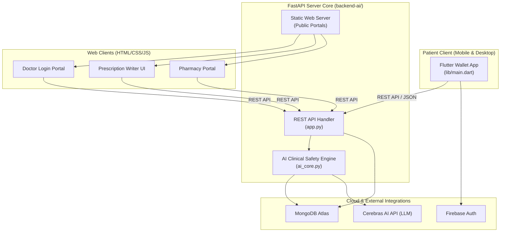

# 🛡️ AegisRx — Sovereign Patient Health Wallet

AegisRx (formerly HealthLock) is a production-quality, zero-trust patient health wallet and clinician suite. It shifts the ownership of clinical data from centralized hospital systems directly to the **patient as the sovereign custodian** of their own medical records, prescriptions, and access permissions.

---

## 🎯 Architecture Pillars

AegisRx is built upon four architectural pillars designed to ensure zero-trust security, clinical accuracy, and cryptographic data integrity:

```
  ┌─────────────────────────────────────────────────────────────┐
  │                    1. ZERO-TRUST CONSENT                    │
  │  Doctors cannot access patient history or write prescriptions │
  │  without explicit scanning and approval of a session token.  │
  └──────────────────────────────┬──────────────────────────────┘
                                 ▼
  ┌─────────────────────────────────────────────────────────────┐
  │              2. CRYPTOGRAPHIC TAMPER-PROOFING               │
  │  Prescriptions are hashed with SHA-256 and signed with the  │
  │  physician's NPI-keyed signature. Checks validation at desk.│
  └──────────────────────────────┬──────────────────────────────┘
                                 ▼
  ┌─────────────────────────────────────────────────────────────┐
  │                 3. AI CLINICAL SAFETY NET                  │
  │  Real-time drug-drug and drug-allergy interaction checking  │
  │  powered by Cerebras LLM + IsolationForest anomalies.       │
  └──────────────────────────────┬──────────────────────────────┘
                                 ▼
  ┌─────────────────────────────────────────────────────────────┐
  │             4. IMMUTABLE ACTIVITY LEDGER LOGS               │
  │  All access, creation, and dispensation logs are chained     │
  │  chronologically with SHA-256, stored in MongoDB Atlas.     │
  └─────────────────────────────────────────────────────────────┘
```

---

## 🏗️ System Architecture & Data Flow

AegisRx connects three primary roles (Patient, Doctor, and Pharmacist) via a central, high-performance FastAPI server:



### 🔄 End-to-End Consultation Lifecycle

1. **Session Handshake**: The patient generates an attendance session token (displayed as a QR code). The doctor scans it to request access.
2. **Access Grant**: The patient receives a polling notification and taps **Accept** to approve the connection.
3. **Safety Audit & Writing**: The doctor drafts the prescription. Prior to submission, a pre-flight check executes checks for duplicates, allergy conflicts, drug-drug interactions, and anomaly patterns.
4. **Signing & Commit**: Upon submission, the server computes a `SHA-256` hash of the prescription, encrypts it with the doctor's NPI key, saves it to MongoDB, and writes the event to the chained activity log.
5. **Validation & Dispense**: The pharmacist scans the prescription QR, computes the local hash, decrypts the signature, checks that `Reconstructed Hash == Decrypted Signature`, and marks it as dispensed (burning the token).

---

## 🛠️ Complete Technology Stack

| Layer | Technology | Purpose |
| :--- | :--- | :--- |
| **Frontend** | **Flutter 3.10+ (Dart)** | Cross-platform Patient Wallet using Provider state management and Material dark themes. |
| **Backend** | **FastAPI (Python 3.11+)** | REST API endpoints, static file hosting, and request routers. |
| **AI Engine** | **Cerebras AI API (LLM)** | Rapid drug interaction evaluations and alternative drug recommendations. |
| **Outlier Detection** | **scikit-learn (Isolation Forest)** | Analyzes physician prescription history frequencies to flag patterns. |
| **Database** | **MongoDB Atlas** | Document storage for prescriptions, patient allergies, and audit logs. |
| **Authentication** | **Firebase Auth / Cognito** | Sovereign credentials validation and secure identity mapping. |
| **Cryptography** | **SHA-256** | Secure hash chains for activity ledgers and signature verification. |

---

## 📁 Codebase Directory Structure

* [**lib/**](file:///c:/Users/srima/hackathon%20votexa/health_lock/lib): Flutter Patient Wallet Source
  * [main.dart](file:///c:/Users/srima/hackathon%20votexa/health_lock/lib/main.dart): App launch & state provider injection.
  * [core/theme/app_theme.dart](file:///c:/Users/srima/hackathon%20votexa/health_lock/lib/core/theme/app_theme.dart): App colors, styling, and gradients.
  * [core/routing/app_router.dart](file:///c:/Users/srima/hackathon%20votexa/health_lock/lib/core/routing/app_router.dart): Listen-based dynamic router delegates.
  * [core/state/app_state.dart](file:///c:/Users/srima/hackathon%20votexa/health_lock/lib/core/state/app_state.dart): Session role and token managers.
  * [core/network/api_client.dart](file:///c:/Users/srima/hackathon%20votexa/health_lock/lib/core/network/api_client.dart): Adds headers for session tokens.
  * [core/crypto/crypto_helper.dart](file:///c:/Users/srima/hackathon%20votexa/health_lock/lib/core/crypto/crypto_helper.dart): Validates cryptographic hashes and signatures.
  * [features/patient/screens/](file:///c:/Users/srima/hackathon%20votexa/health_lock/lib/features/patient/screens): Screens for dashboard, login, settings, share, and history logs.
  * [shared/models/](file:///c:/Users/srima/hackathon%20votexa/health_lock/lib/shared/models): Models for user, encounter, prescription, risk, and token states.
* [**backend-ai/**](file:///c:/Users/srima/hackathon%20votexa/health_lock/backend-ai): FastAPI AI backend core
  * [app.py](file:///c:/Users/srima/hackathon%20votexa/health_lock/backend-ai/app.py): REST routers, CORS config, database seeding, and static pages serving.
  * [ai_core.py](file:///c:/Users/srima/hackathon%20votexa/health_lock/backend-ai/ai_core.py): MongoDB connector, Cerebras API queries, and IsolationForest anomaly analyzer.
  * [public/](file:///c:/Users/srima/hackathon%20votexa/health_lock/backend-ai/public): Lightweight practitioner HTML/JS web clients (Doctor and Pharmacy desk portals).

---

## 🚀 Getting Started & Execution

### 1. Configure the Environment
Create a `.env` file under `backend-ai/` matching your database credentials:
```bash
MONGODB_URI=mongodb+srv://<user>:<password>@<cluster>.mongodb.net/?appName=<app>
MONGODB_DATABASE=healthcare_db
CEREBRAS_API_KEY=<your-key>
```

### 2. Start the Backend Server
```bash
cd backend-ai
pip install -r requirements.txt
python app.py
```
* Interactive Swagger Docs: [http://127.0.0.1:5000/docs](http://127.0.0.1:5000/docs)

### 3. Launch the Flutter App
```bash
# Return to the root folder
flutter pub get
flutter run
```

---

## 🧪 Testing Scenario Guide

1. Open the Flutter App. It launches to [PatientLoginScreen](file:///c:/Users/srima/hackathon%20votexa/health_lock/lib/features/patient/screens/patient_login_screen.dart).
2. Enter email and click **Unlock Patient Vault** to login. It redirects you to the dashboard.
3. Open `http://127.0.0.1:5000/doctor-login` in your web browser. Log in as a doctor and request a connection with the patient.
4. Accept the connection in the Flutter App.
5. In the doctor panel, write a prescription. Prior to submitting, click **Run Pre-flight Clinical Audit** to see Cerebras AI interaction warning diagnostics.
6. Submit the prescription. It will sign the payload and commit it to MongoDB.
7. Open `http://127.0.0.1:5000/pharmacy-portal` in another browser window, search the prescription ID, verify the signature, and tap **Dispense Medications** to burn the token.
