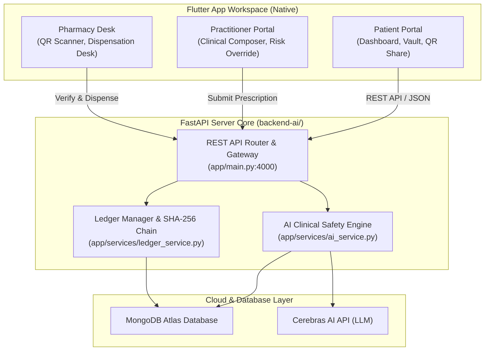

# 🛡️ AegisRx — Sovereign Patient Health Wallet

AegisRx is a zero-trust, decentralized patient health wallet and clinician suite. It shifts the ownership of clinical data from centralized hospital systems directly to the **patient as the sovereign custodian** of their own medical records, prescriptions, and access permissions.

---

## 🎯 Architecture Pillars

AegisRx is built upon four architectural pillars designed to ensure zero-trust security, clinical accuracy, and cryptographic data integrity:

```
  ┌─────────────────────────────────────────────────────────────┐
  │                    1. ZERO-TRUST CONSENT                    │
  │  Doctors cannot access patient history or write prescriptions │
  │  without explicit scanning and approval of a session token.  │
  └──────────────────────────────┬──────────────────────────────┘
                                 ▼
  ┌─────────────────────────────────────────────────────────────┐
  │              2. CRYPTOGRAPHIC TAMPER-PROOFING               │
  │  Prescriptions are hashed with SHA-256 and signed with the  │
  │  physician's NPI-keyed signature. Checks validation at desk.│
  └──────────────────────────────┬──────────────────────────────┘
                                 ▼
  ┌─────────────────────────────────────────────────────────────┐
  │                 3. AI CLINICAL SAFETY NET                  │
  │  Real-time drug-drug and drug-allergy interaction checking  │
  │  powered by Cerebras LLM + IsolationForest anomalies.       │
  └──────────────────────────────┬──────────────────────────────┘
                                 ▼
  ┌─────────────────────────────────────────────────────────────┐
  │             4. IMMUTABLE ACTIVITY LEDGER LOGS               │
  │  All access, creation, and dispensation logs are chained     │
  │  chronologically with SHA-256, stored in MongoDB Atlas.     │
  └─────────────────────────────────────────────────────────────┘
```

---

## 🏗️ System Architecture & Data Flow

AegisRx integrates Patient, Doctor, and Pharmacist workflows into a native, high-performance Flutter mobile/desktop app communicating with a central FastAPI backend:



### 🔄 End-to-End Consultation Lifecycle

1. **Session Handshake**: The patient generates a secure consultation session token (displayed as a QR code). The doctor scans the QR code to request permission.
2. **Access Grant**: The patient receives a real-time polling notification and taps **Accept** to approve the connection.
3. **Safety Audit & Writing**: The doctor drafts the prescription. Prior to submission, a pre-flight check executes checks for duplicates, allergy conflicts, drug-drug interactions, and anomaly patterns.
4. **Signing & Commit**: Upon submission, the server computes a `SHA-256` hash of the prescription, signs it using the doctor's NPI root key, saves it to MongoDB, and writes the block to the chained activity ledger.
5. **Validation & Dispense**: The pharmacist scans the patient's checkout QR, triggers `/api/pharmacy/verify-scan`, verifies signature integrity against the root ledger, and calls `/api/pharmacy/dispense` to burn the token.

---

## 🛠️ Complete Technology Stack

| Layer | Technology | Purpose |
| :--- | :--- | :--- |
| **Frontend** | **Flutter 3.10+ (Dart)** | Unified Patient Wallet, Doctor Clinical Composer, and Pharmacy desk. |
| **Backend** | **FastAPI (Python 3.11+)** | High-performance API Gateway and microservice routing. |
| **AI Engine** | **Cerebras AI API (LLM)** | Rapid drug interaction evaluations and alternative recommendations. |
| **Outlier Detection** | **scikit-learn (Isolation Forest)** | Analyzes physician prescription history frequencies to flag anomalies. |
| **Database** | **MongoDB Atlas** | Document storage for prescriptions, patient allergies, and audit logs. |
| **Cryptography** | **SHA-256** | Secure hash chains for activity ledgers and signature verification. |

---

## 📁 Codebase Directory Structure

* [**lib/**](file:///e:/health_aegisRX/lib): Flutter Unified Multi-Role Client
  * [main.dart](file:///e:/health_aegisRX/lib/main.dart): App launch & state provider injection.
  * [core/theme/app_theme.dart](file:///e:/health_aegisRX/lib/core/theme/app_theme.dart): App colors, styling, and gradients.
  * [core/routing/app_router.dart](file:///e:/health_aegisRX/lib/core/routing/app_router.dart): Listen-based dynamic router delegates.
  * [core/state/app_state.dart](file:///e:/health_aegisRX/lib/core/state/app_state.dart): Session, Auth, and live API client networking logic.
  * [features/patient/](file:///e:/health_aegisRX/lib/features/patient): Patient flows (dashboard, history logs, QR share).
  * [features/doctor/](file:///e:/health_aegisRX/lib/features/doctor): Doctor flows (Composer, Override, and Sign).
  * [features/pharmacy/](file:///e:/health_aegisRX/lib/features/pharmacy): Pharmacist flows (QR scanning, crypt-verdict, dispense token burn).
* [**backend-ai/**](file:///e:/health_aegisRX/backend-ai): FastAPI AI backend core
  * [app/main.py](file:///e:/health_aegisRX/backend-ai/app/main.py): REST routers, CORS config, database seeding.
  * [app/services/](file:///e:/health_aegisRX/backend-ai/app/services): Modular services for auth, prescriptions, ledger, and AI safety checks.

---

## 🚀 Getting Started & Execution

### 1. Configure the Environment
Create a `.env` file under `backend-ai/` matching your database credentials:
```bash
MONGODB_URI=mongodb+srv://<user>:<password>@<cluster>.mongodb.net/?appName=<app>
MONGODB_DATABASE=healthcare_db
CEREBRAS_API_KEY=<your-key>
```

### 2. Start the Backend Server
```bash
cd backend-ai
python -m venv venv
# Windows
.\venv\Scripts\activate
# Install deps and run
pip install -r requirements.txt
python -m uvicorn app.main:app --host 0.0.0.0 --port 4000 --reload
```
* Interactive Swagger Docs: [http://127.0.0.1:4000/docs](http://127.0.0.1:4000/docs)

### 3. Launch the Flutter App
```bash
# Return to the root folder
flutter pub get
flutter run
```

---

## 🧪 Testing Scenario Guide

1. **Patient Access**: Open the Flutter app, choose **Patient Portal**, register/login, and view the dashboard. Tap **Share Session** to generate an attendance QR code.
2. **Clinician Encounter**: On the home portal, choose **Doctor Portal**, register or log in as a clinician (using your NPI). Click **New Consultation Session** and scan/paste the patient's QR code.
3. **Consent Polling**: The patient dashboard will display a pending consultation request. Tap **Accept** to authorize the connection.
4. **Draft & Auditing**: The doctor's Clinical Composer will unlock. Type the diagnosis and add a medication (e.g. penicillin). The AI Risk Band will automatically trigger and run safety audits against patient allergies.
5. **Ledger Commit**: Click **Proceed to Sign** and log clinical justifications. Submit the signature to commit the prescription securely to the blockchain ledger.
6. **Pharmacy Checkout**: Tap the patient's prescription on their dashboard, view the checkout QR code, and copy the payload (representing `Data##Signature`).
7. **Dispense Desk**: On the home portal, choose **Pharmacy Portal**, paste the QR payload, verify signature validity against root keys, and click **Burn Token & Dispense** to dispense medications.
