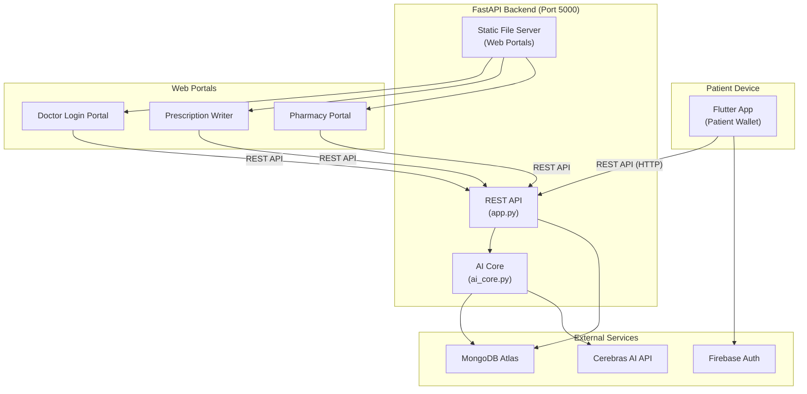
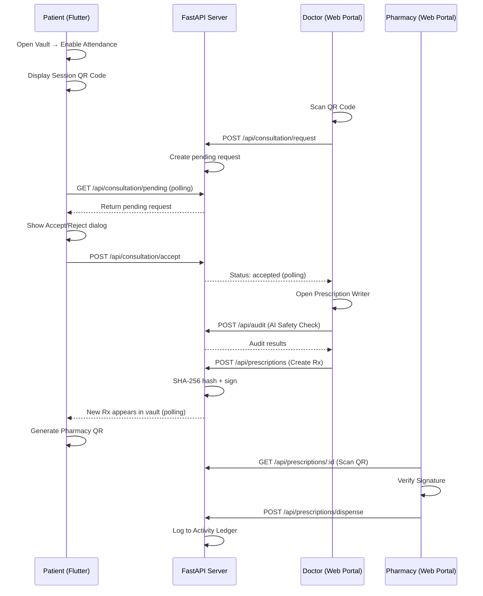
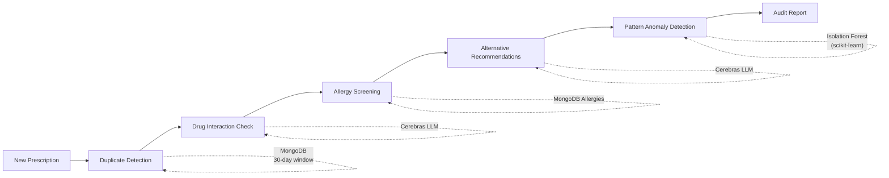

<](https://flutter.dev)
[](https://fastapi.tiangolo.com)
[](https://www.mongodb.com/atlas)
[](https://cerebras.ai)
[](https://firebase.google.com)
[]()

</div>

---

## 📋 Table of Contents

- [Overview](#-overview)
- [Key Features](#-key-features)
- [Architecture](#-architecture)
- [Tech Stack](#-tech-stack)
- [Project Structure](#-project-structure)
- [Prerequisites](#-prerequisites)
- [Getting Started](#-getting-started)
- [Backend API Reference](#-backend-api-reference)
- [Security Model](#-security-model)
- [AI Clinical Safety Pipeline](#-ai-clinical-safety-pipeline)
- [Web Portals](#-web-portals)
- [Screenshots](#-screenshots)
- [Environment Variables](#-environment-variables)
- [Contributing](#-contributing)
- [License](#-license)

---

## 🌐 Overview

**HealthLock** is a hackathon-built, production-quality prototype that reimagines how patients interact with their medical prescriptions. Instead of doctors or hospitals owning patient data, **the patient is the sovereign custodian** of their own health records.

The system implements a **three-portal architecture** spanning:

| Portal | Technology | Description |
|--------|-----------|-------------|
| 🧑‍⚕️ **Patient Wallet** | Flutter (Android / iOS / Desktop / Web) | Patients view, manage, and approve access to their prescriptions. |
| 👨‍⚕️ **Doctor Portal** | Web (HTML/CSS/JS served by FastAPI) | Doctors scan a QR code, request access, and write prescriptions with AI audit. |
| 💊 **Pharmacy Portal** | Web (HTML/CSS/JS served by FastAPI) | Pharmacists scan prescriptions, verify cryptographic signatures, and dispense medications. |

Every prescription is **cryptographically signed** at creation, and every access event is written to an **immutable activity ledger** (hash-chained log).

---

## ✨ Key Features

### 🔒 Patient Sovereignty
- **Zero-trust access model** — Doctors must scan a session QR and the patient must explicitly **Accept** or **Reject** each consultation request.
- **Offline-first** — The Flutter app gracefully falls back to local mock data when the backend is unreachable.

### 🧬 Cryptographic Prescription Integrity
- **SHA-256 hashing** of every prescription payload (patient, doctor, medicines, date).
- **Hex-shifted digital signatures** using the doctor's unique sign ID.
- **Tamper verification** on the pharmacy side — any field change invalidates the signature.

### 🤖 AI-Powered Clinical Safety (Cerebras LLM)
- **Duplicate Detection** — Flags re-prescriptions within a configurable 30-day window.
- **Drug Interaction Screening** — Checks new drugs against the patient's active medication list.
- **Allergy Conflict Detection** — Cross-references prescriptions against MongoDB-stored allergy profiles.
- **Alternative Recommendations** — Suggests allergy-safe substitutes for flagged drugs.
- **Prescribing Pattern Analysis** — Uses Isolation Forest (scikit-learn) to detect anomalous prescribing behavior by physicians.

### 🔑 Authentication
- **Firebase Auth** — Google Sign-In, Email/Password, with automatic fallback.
- **Offline Guest Mode** — Full functionality without credentials for demo / hackathon evaluation.

### 📜 Immutable Activity Ledger
- Every significant event (login, scan, create, dispense, accept, reject) is logged with a **SHA-256 hash chain**, creating a tamper-evident audit trail stored in MongoDB.

---

## 🏗️ Architecture



### Data Flow — Consultation Lifecycle



---

## 🛠️ Tech Stack

| Layer | Technology | Purpose |
|-------|-----------|---------|
| **Mobile / Desktop** | Flutter 3.10+ (Dart) | Cross-platform patient wallet |
| **Backend** | Python 3.11+ / FastAPI | REST API, static serving, business logic |
| **Database** | MongoDB Atlas | Prescriptions, allergies, doctors, activity logs |
| **AI / ML** | Cerebras API (LLM), scikit-learn | Drug interactions, recommendations, anomaly detection |
| **Auth** | Firebase Auth | Google Sign-In, Email/Password |
| **Crypto** | SHA-256 + hex-shift cipher | Prescription signing & verification |
| **Web Portals** | Vanilla HTML/CSS/JS | Doctor login, prescription writer, pharmacy scanner |

---

## 📁 Project Structure

```
health_lock/
├── lib/                                # Flutter application source
│   ├── main.dart                       # App entry point, state management (Provider)
│   ├── firebase_options.dart           # Auto-generated Firebase config
│   ├── core/
│   │   ├── constants/
│   │   │   ├── app_colors.dart         # Design system color tokens
│   │   │   └── mock_prescriptions.dart # Offline fallback data
│   │   ├── crypto/
│   │   │   └── crypto_helper.dart      # Client-side SHA-256 + signature utils
│   │   └── theme/
│   │       └── app_theme.dart          # Material dark theme configuration
│   ├── features/
│   │   ├── patient/
│   │   │   └── screens/
│   │   │       ├── splash_screen.dart      # Animated launch screen
│   │   │       ├── onboarding_screen.dart  # First-run onboarding carousel
│   │   │       ├── patient_login.dart      # Firebase / Guest login
│   │   │       └── patient_vault.dart      # Main wallet UI (prescriptions, QR, attendance)
│   │   ├── doctor/                         # (Reserved for future native doctor features)
│   │   └── pharmacy/
│   │       └── screens/                    # (Reserved for future native pharmacy features)
│   └── shared/
│       ├── models/
│       │   └── prescription.dart       # Prescription data model
│       └── widgets/
│           └── custom_button.dart      # Reusable glassmorphic button
│
├── backend-ai/                         # FastAPI backend service
│   ├── app.py                          # Main API server (819 lines)
│   ├── ai_core.py                      # AI Agent: MongoDB + Cerebras + ML pipeline
│   ├── config.py                       # Environment config loader
│   ├── requirements.txt                # Python dependencies
│   ├── insert_sample_data.py           # Seed script for demo data
│   ├── .env                            # Backend secrets (MongoDB URI, API keys)
│   └── public/                         # Static web portals
│       ├── doctor-login.html           # Doctor QR scanner + login
│       ├── doctor-prescription.html    # Multi-drug prescription form with AI audit
│       ├── pharmacy-portal.html        # Pharmacy scan + verify + dispense
│       └── css/
│           └── style.css               # Shared portal stylesheet
│
├── .env                                # Flutter-side Firebase config
├── firebase.json                       # Firebase project configuration
├── pubspec.yaml                        # Flutter dependencies
├── start_demo.bat                      # One-click demo launcher (Windows)
├── android/                            # Android platform files
├── ios/                                # iOS platform files
├── web/                                # Flutter web build files
├── windows/                            # Windows desktop platform files
├── macos/                              # macOS platform files
└── linux/                              # Linux platform files
```

---

## 📦 Prerequisites

| Requirement | Version | Notes |
|-------------|---------|-------|
| **Flutter SDK** | ≥ 3.10.4 | [Install Flutter](https://docs.flutter.dev/get-started/install) |
| **Dart SDK** | ≥ 3.10.4 | Included with Flutter |
| **Python** | ≥ 3.9 | Required for the FastAPI backend |
| **pip** | Latest | Python package manager |
| **MongoDB** | Atlas (cloud) or local | Connection string configured in `.env` |
| **Git** | Latest | Version control |

**Optional:**
- **Android Studio / Xcode** — For mobile emulator/simulator
- **Chrome** — For Flutter web development
- **Firebase CLI** — Only if reconfiguring Firebase project

---

## 🚀 Getting Started

### 1. Clone the Repository

```bash
git clone https://github.com/AI-develop2006/vortexa.hackathon.git
cd vortexa.hackathon
git checkout feature-sovereign
```

### 2. Setup the Backend

```bash
cd backend-ai

# Create and activate a virtual environment (recommended)
python -m venv venv
# Windows:
venv\Scripts\activate
# macOS/Linux:
source venv/bin/activate

# Install Python dependencies
pip install -r requirements.txt
```

### 3. Configure Environment Variables

Copy and edit the backend `.env` file:

```bash
# backend-ai/.env
MONGODB_URI=mongodb+srv://<user>:<password>@<cluster>.mongodb.net/?appName=<app>
MONGODB_DATABASE=healthcare_db
COLLECTION_PRESCRIPTIONS=prescriptions
COLLECTION_ALLERGIES=allergies

CEREBRAS_API_KEY=<your-cerebras-api-key>
CEREBRAS_API_URL=https://api.cerebras.ai/v1/chat/completions
CEREBRAS_MODEL=gpt-oss-120b

MOCK_CEREBRAS=False    # Set to True to use mock AI responses
```

For the Flutter app, edit the root `.env`:

```bash
# .env (project root)
FIREBASE_API_KEY=<your-firebase-api-key>
FIREBASE_APP_ID=<your-firebase-app-id>
FIREBASE_PROJECT_ID=<your-project-id>
FIREBASE_MESSAGING_SENDER_ID=<sender-id>
FIREBASE_STORAGE_BUCKET=<bucket-url>
FIREBASE_IOS_BUNDLE_ID=com.example.healthLock
```

### 4. Seed Demo Data (Optional)

```bash
cd backend-ai
python insert_sample_data.py
```

### 5. Start the Backend Server

```bash
cd backend-ai
python app.py
```

The API server will start at **`http://127.0.0.1:5000`**.
- Interactive API docs: [http://127.0.0.1:5000/docs](http://127.0.0.1:5000/docs) (Swagger UI)
- Alternative docs: [http://127.0.0.1:5000/redoc](http://127.0.0.1:5000/redoc)

### 6. Start the Flutter App

In a new terminal:

```bash
# From project root
flutter pub get
flutter run
```

Select your target device (Android emulator, iOS simulator, Chrome, Windows, etc.).

> **Tip:** For the best demo experience, run the Flutter app and open the Doctor Portal in a browser side-by-side.

---

## 📡 Backend API Reference

Base URL: `http://127.0.0.1:5000`

### General

| Method | Endpoint | Description |
|--------|----------|-------------|
| `GET` | `/` | Health check & API metadata |
| `GET` | `/docs` | Swagger interactive documentation |

### Prescription Management

| Method | Endpoint | Description |
|--------|----------|-------------|
| `GET` | `/api/prescriptions?patient=<name>` | Fetch all prescriptions for a patient |
| `POST` | `/api/prescriptions` | Create a new signed prescription |
| `GET` | `/api/prescriptions/{rx_id}` | Get a single prescription by ID |
| `POST` | `/api/prescriptions/dispense` | Mark a prescription as dispensed |

### Consultation Management

| Method | Endpoint | Description |
|--------|----------|-------------|
| `POST` | `/api/consultation/request` | Doctor initiates a consultation request |
| `GET` | `/api/consultation/pending?patient=<name>` | Get latest pending request for patient |
| `GET` | `/api/consultation/status/{req_id}` | Check consultation request status |
| `POST` | `/api/consultation/accept` | Patient accepts consultation request |
| `POST` | `/api/consultation/reject` | Patient rejects consultation request |

### Doctor Management

| Method | Endpoint | Description |
|--------|----------|-------------|
| `POST` | `/api/doctor/login` | Doctor sign-in by mobile number |
| `POST` | `/api/doctor/register` | Register a new doctor profile |

### Clinical AI Audit

| Method | Endpoint | Description |
|--------|----------|-------------|
| `POST` | `/api/audit` | Full clinical audit (duplicates + interactions + allergies + recommendations) |
| `POST` | `/api/duplicate-check` | Check for duplicate prescriptions |
| `POST` | `/api/interaction-check` | Check drug-drug interactions |
| `POST` | `/api/allergy-check` | Check allergy conflicts |
| `POST` | `/api/recommendations` | Get alternative drug recommendations |
| `GET` | `/api/pattern-analysis/{doctor_id}` | Analyze doctor's prescribing patterns |

### Activity Ledger

| Method | Endpoint | Description |
|--------|----------|-------------|
| `GET` | `/api/activity-logs` | Retrieve the full audit trail |

### Web Portals

| Method | Endpoint | Description |
|--------|----------|-------------|
| `GET` | `/doctor-login` | Doctor login & QR scanner portal |
| `GET` | `/doctor-prescription` | Prescription writer with AI audit |
| `GET` | `/pharmacy-portal` | Pharmacy scan, verify & dispense portal |

---

## 🔐 Security Model

### Prescription Signing Flow

```
1. Doctor fills prescription form → structured JSON payload
2. JSON payload → SHA-256 hash (64-char hex digest)
3. Hash → hex-shift cipher using doctor's unique sign ID
4. Result = digital signature stored alongside the prescription
```

### Verification (Pharmacy Side)

```
1. Pharmacy scans QR → fetches prescription from API
2. Rebuild JSON payload from prescription fields
3. SHA-256 hash the reconstructed payload
4. Decrypt stored signature using doctor's sign ID (reverse hex-shift)
5. Compare: if decrypted signature == computed hash → ✅ VALID
6. Any mismatch → ❌ TAMPERED — dispense is blocked
```

### Activity Ledger Integrity

Each activity log entry includes a SHA-256 hash computed from:
```
timestamp + eventType + patientName + actorId + details
```
This creates a content-addressed, tamper-evident audit trail.

---

## 🤖 AI Clinical Safety Pipeline

The `ai_core.py` module implements a multi-layered safety net:



| Check | Data Source | Method |
|-------|-----------|--------|
| Duplicate Detection | MongoDB prescriptions | Time-windowed query (configurable 30 days) |
| Drug Interactions | Cerebras LLM API | Prompt-based analysis against active medications |
| Allergy Screening | MongoDB allergy profiles | Direct database cross-reference |
| Alternative Drugs | Cerebras LLM API | Ranked, allergy-safe suggestions |
| Pattern Analysis | MongoDB prescriptions | Isolation Forest anomaly detection (scikit-learn) |

> **Fallback:** When the Cerebras API key is not configured, the system automatically switches to **mock mode** with pre-built safe responses.

---

## 🖥️ Web Portals

### Doctor Login Portal (`/doctor-login`)
- Register or sign in with a mobile number
- Built-in QR code scanner (camera-based)
- Scans the patient's session QR to initiate a consultation request
- Real-time polling to check if the patient has accepted/rejected

### Prescription Writer (`/doctor-prescription`)
- Multi-drug form with dynamic add/remove rows
- Integrated AI clinical audit before submission
- Displays duplicate warnings, interaction alerts, and allergy conflicts
- Server-side cryptographic signing on submission

### Pharmacy Portal (`/pharmacy-portal`)
- QR code scanner for prescription codes
- **Cryptographic signature verification** (SHA-256 + hex-shift)
- Visual status indicators (Valid ✅ / Tampered ❌ / Already Dispensed ⚠️)
- One-click dispense with ledger logging

---

## 🖼️ Screenshots

> _Screenshots can be added here. Run the app and capture the key screens:_
> - Splash → Onboarding → Login → Patient Vault → QR Code
> - Doctor Login → Prescription Writer → AI Audit
> - Pharmacy Portal → Signature Verification → Dispense

---

## ⚙️ Environment Variables

### Backend (`backend-ai/.env`)

| Variable | Description | Default |
|----------|-------------|---------|
| `MONGODB_URI` | MongoDB connection string | `mongodb://localhost:27017/` |
| `MONGODB_DATABASE` | Database name | `healthcare_db` |
| `COLLECTION_PRESCRIPTIONS` | Prescriptions collection name | `prescriptions` |
| `COLLECTION_ALLERGIES` | Allergies collection name | `allergies` |
| `CEREBRAS_API_KEY` | Cerebras API key for LLM calls | `your_api_key_here` |
| `CEREBRAS_API_URL` | Cerebras API endpoint | `https://api.cerebras.ai/v1/chat/completions` |
| `CEREBRAS_MODEL` | LLM model identifier | `llama3.1-8b` |
| `MOCK_CEREBRAS` | Enable mock AI responses | `True` |
| `DUPLICATE_TOLERANCE_DAYS` | Duplicate detection window | `30` |
| `PRESCRIPTION_HISTORY_DAYS` | History lookback for analysis | `90` |

### Flutter App (`.env` at project root)

| Variable | Description |
|----------|-------------|
| `FIREBASE_API_KEY` | Firebase Web API key |
| `FIREBASE_APP_ID` | Firebase Application ID |
| `FIREBASE_PROJECT_ID` | Firebase Project ID |
| `FIREBASE_MESSAGING_SENDER_ID` | FCM Sender ID |
| `FIREBASE_STORAGE_BUCKET` | Firebase Storage bucket URL |
| `FIREBASE_IOS_BUNDLE_ID` | iOS bundle identifier |

---

## 🧪 Running Tests

### Flutter

```bash
flutter test
```

### Backend

```bash
cd backend-ai
# Run the seed script to verify MongoDB connectivity
python insert_sample_data.py

# Hit the API to verify
curl http://127.0.0.1:5000/
curl http://127.0.0.1:5000/api/prescriptions?patient=Elena%20Vance
```

---

## 🤝 Contributing

1. **Fork** the repository
2. **Create** a feature branch (`git checkout -b feature/my-feature`)
3. **Commit** your changes (`git commit -m 'feat: add my feature'`)
4. **Push** to the branch (`git push origin feature/my-feature`)
5. Open a **Pull Request**

Please follow conventional commit messages (`feat:`, `fix:`, `docs:`, `refactor:`, etc.).

---

## 📄 License

This project is licensed under the **MIT License**. See the [LICENSE](LICENSE) file for details.

---

<div align="center">

**Built with ❤️ for the Vortexa Hackathon 2026**

_HealthLock — Because your health data belongs to you._

</div>
]]>
