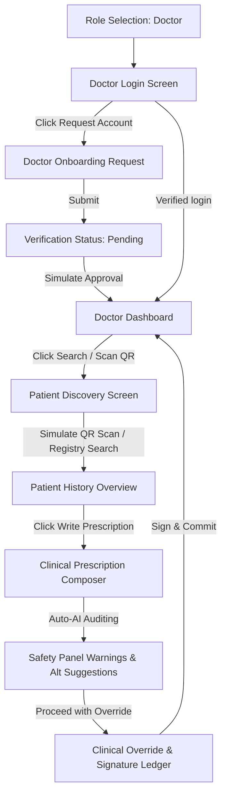

# Doctor Flow Lifecycle - Version 1

This document specifies the exact widgets, fields, state variables, business logic, validation rules, and color configurations implemented across the AegisRx doctor portal screens.

---

## 1. Flow Diagram

---

## 2. Screen-by-Screen Specifications

### Step 1: Onboarding Request
* **Screen**: DoctorOnboardingScreen
* **Form Fields**:
  * Name: Full Name
  * NPI/License: Medical License Number / NPI
  * Hospital: Hospital / Clinic Name
  * Specialty: Doctor Specialty
  * Email: Official Email Address
  * Phone: Official Phone Number
* **Logic**:
  * Validates required entries are filled, shows SnackBar warnings if empty.
  * Calls requestDoctorVerification(..., approved: false) placing the registration into a Pending state.
  * Starts doctor session and redirects.

### Step 2: Verification Status
* **Screen**: DoctorVerificationStatusScreen
* **Displays**:
  * Doctor name, hospital details, and pending badge.
* **Logic**:
  * Shows Pending status message informing details are being reviewed.
  * Renders a "Simulate Approval Verification" button. Tapping it calls requestDoctorVerification(..., approved: true) which instantly flips the state and routes to the dashboard console.

### Step 3: Practitioner Dashboard
* **Screen**: DoctorDashboardScreen
* **UI Elements**:
  * **Practitioner Header Card**: Lists doctor name, license number, hospital branch, and specialty fields.
  * **Active Consultation Banner**:
    * If active, shows the connected patient's name/ID and an "Open Vault" history button.
    * If inactive, displays "No active patient session connected."
  * **Today's Appointments List**: Interactive rows for mock appointments (Priya Sharma, Elena Vance).
  * **CTA Button**: "Search Patient / Scan QR".

### Step 4: Patient Discovery
* **Screen**: DoctorPatientSearchScreen
* **UI Elements**:
  * **Registry Search Field**: Filters mock patient profiles (Priya Sharma, Elena Vance) in real-time.
  * **Viewfinder Scan Frame**: Styled camera preview simulation with a pulsating scanning label.
  * **Simulate QR Scan Action**: Triggers a 1.2s delayed mock scanner. Calls startDoctorPatientSession('elena_vance', 'Elena Vance') to establish the connection, displays success notifications, and opens the history screen.

### Step 5: Patient Vault History
* **Screen**: DoctorPatientHistoryScreen
* **UI Elements**:
  * **Allergy Chips**: Red status highlight tags (e.g. Penicillin, Peanuts).
  * **Chronic Condition Chips**: Teal highlight tags (e.g. Type-2 Diabetes).
  * **Timeline Encounter Logs**: Text summaries of past clinical records.
  * **Historical Prescriptions**: List cards showing past medications, duration, risk bands (LOW/HIGH), and override justifications.
  * **CTA Button**: "Write New Prescription" -> Opens composer.

### Step 6: Clinical Composer & Auto-AI Auditing
* **Screen**: DoctorPrescriptionEditorScreen
* **Form Inputs**:
  * Chief Complaint / Problem (Multi-line)
  * Provisional Diagnosis (Single line)
  * Clinical Notes (Optional Multi-line)
* **Structured Dynamic Medication Rows**:
  * Button "Add Row" appends a new medicine block.
  * Inputs: Drug Name, Strength, Route dropdown (Oral, IV, etc.), Frequency dropdown (Once daily, Twice daily, etc.), Duration value & unit.
  * Button "Delete" removes the corresponding row.
* **Debounced Auto-AI Auditing**:
  * Keystrokes/dropdown changes trigger a 600ms debounced background audit.
  * If the drug list contains Penicillin and the patient is Elena Vance, it triggers a CRITICAL risk score (95/100) and displays warning cards.
  * Renders a list of safe alternatives (e.g., Ciprofloxacin). Tapping Apply Alternative updates the drug name, dosage, and frequency in the row, instantly running another audit and setting the risk level back to LOW.

### Step 7: Override & Digital Sign Commitment
* **Screen**: DoctorOverrideAndSignScreen
* **UI Elements**:
  * Summary cards showing chief complaints, provisional diagnoses, and final medication details.
  * **Override Fields** (Visible only if Risk is HIGH or CRITICAL):
    * Multi-line override justification text field.
    * Override Category dropdown (Clinical judgment, Emergency, Other).
    * Mandatory acknowledgment checkbox.
  * **Sign & Commit Action**:
    * Performs validation checks.
    * Renders a signature loading state.
    * Displays an success Alert Dialog showing the generated mock transaction ledger hash (`0x7a3f89e2c4...`).
    * Closes the patient's active consultation session and pops back to the dashboard on exit.
