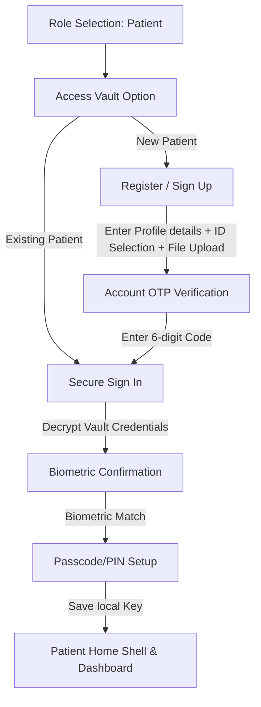

# Patient Flow Lifecycle - Version 2

This document describes the final patient user flow lifecycle implemented in AegisRx (Version 2). The system adheres to the **60-30-10 color rule** and integrates document upload and cryptographic key setup.

---

## 1. Flow Diagram

---

## 2. Screen-by-Screen Specifications

### Step 1: Role Selection & Access Vault Choice
* **Screen**: PatientAuthChoiceScreen
* **Description**: User lands on the role selection and chooses Patient. They are presented with two choices: "I am a new patient" or "I already have an account".
* **Design/Theme**:
  * **60% (Dominant Background)**: Abyssal Obsidian (`0xFF0B0F19`)
  * **30% (Structure/Cards)**: Elevated Slate-Navy (`0xFF141C2F`)
  * **10% (Accents)**: Electric Indigo (`0xFF818CF8`)

### Step 2: Patient Registration & Document Upload
* **Screen**: PatientSignUpScreen
* **Description**: The user inputs personal profile details (Name, Contact, Email, DOB).
* **ID Verification Setup**:
  * Dropdown selector for *Nationality / ID Type* (e.g., Aadhaar, SSN, NHS).
  * Text entry for *ID Number*.
  * ***Upload ID Document Proof***: Tap-to-select local document simulation. It shows the selected filename (e.g. `id_proof_document_aadhaar.pdf`) and an emerald checkmark indicator. Form submission is locked/validated until proof is uploaded.

### Step 3: Contact OTP Verification
* **Screen**: PatientVerificationScreen
* **Description**: User receives a simulated 6-digit verification code sent to their registered contact number. Entering the 6 digits forwards them to the Login screen.
* **Design/Theme**: Legend labels and status text adjust dynamically to guarantee contrast on light/dark modes.

### Step 4: Vault Decryption & Biometrics
* **Screens**:
  * PatientLoginScreen
  * PatientSecureSignInScreen
* **Description**: The user logs in to fetch their encrypted key. Tapping "Sign in securely" triggers device biometric validation simulator to decrypt the local keys.

### Step 5: Setup Unlock PIN
* **Screen**: PatientUnlockSetupScreen
* **Description**: User configures a custom 4-to-6 digit PIN passcode to bypass bios and immediately decrypt their key cache locally.

### Step 6: Patient Dashboard Hub
* **Screen**: PatientDashboardScreen
* **Description**: The primary landing shell after successful unlock. Renders the complete patient profile details:
  * DangerBanner: High-contrast allergy warnings (Penicillin warning).
  * ConsultationStatusChip: Live verification authority status (`ACTIVE`).
  * DoseTimeline: Interactive timeline checking Morning, Afternoon, and Night drug intake slots.
  * InventoryTracker: Pill progress bars checking supply statuses.
  * RiskGauge: Circular visual safety score index (Severity 1-10 indicator).
  * **Share Session**: Connects to PatientShareScreen for quick consent QR scanning.

---

## 3. Global Design System (60-30-10 Rule)
All screens resolve their colors from the global ThemeData:
* **60% Dominant Color**: Scaffold backgrounds default to the theme background (`0xFF0B0F19` in dark mode).
* **30% Secondary Card & Surface Color**: Surfaces, text fields, and list tiles resolve to card color (`0xFF141C2F` in dark mode).
* **10% Highlight Accent**: Primary actions, button states, and neon glow colors resolve to colorScheme.primary (`0xFF818CF8` in dark mode).

---

## 4. Patient Settings Hub
* **Screen**: PatientSettingsScreen
* **Sections**:
  * Profile Card: "Personal details".
  * Security Card: "Change PIN", "Biometric unlock" (SwitchListTile).
  * About Card: "Terms of Use", "Privacy Policy".
  * Sign Out Button: Bottom styled button calling clearSession() to burn cached key states and return to onboarding flow.
