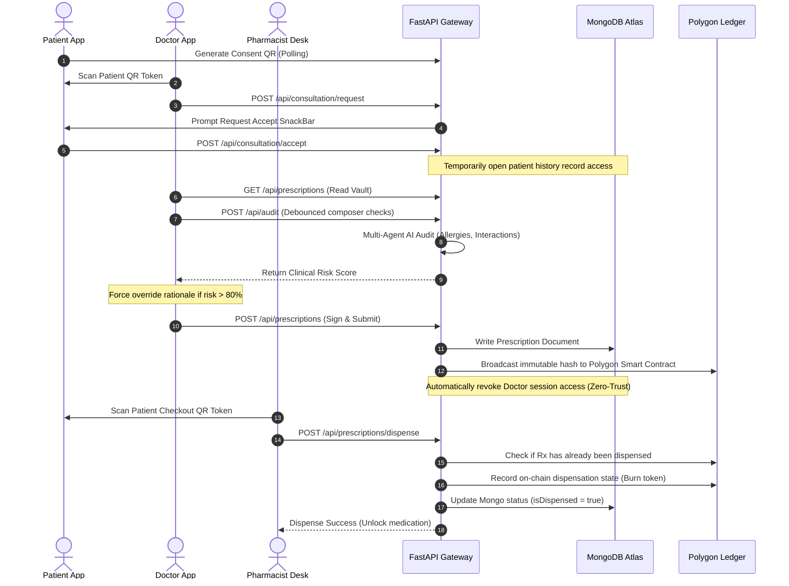

# 🛡️ AegisRx - Architectural Design & Data Mode Registry

This document provides a comprehensive mapping of the **AegisRx** system architecture, directory layouts, and runtime flows. It explicitly charts where the application utilizes **Real Backend Services** versus where it relies on **Mock/Simulation Fallbacks** across development, hackathon, and production modes.

---

## 📂 1. Directory Architecture

The AegisRx ecosystem is built as a zero-trust, dual-ledger clinical platform. The source code is organized into two primary layers: a **Flutter Multi-Role Mobile Client** (`lib/`) and a **Modular FastAPI Backend** (`backend-ai/`).

### Frontend Directory Layout (`health_lock/lib/`)
```
lib/
├── main.dart                               # Application entry, global Provider state, AppTheme
├── core/                                   # Core platform utility classes
│   ├── constants/                          # Theme colors, text styling rules, mock lists
│   ├── crypto/                             # Hex-shift cryptography & hash helpers
│   ├── network/                            # Network reachability and endpoints configuration
│   ├── routing/                            # Multi-role routing tables
│   ├── state/                              # AppState notifier orchestrating all UI actions
│   ├── theme/                              # Modern Neon-Dark visual system (60-30-10 rule)
│   └── utils/                              # ErrorMapper and word formatting libraries
├── features/                               # Screen and widget configurations by user role
│   ├── onboarding/                         # App startup walkthroughs & splash screens
│   ├── patient/                            # Patient auth, PIN settings, sharing, and dashboard
│   │   ├── screens/                        # Patient main dashboard, secure login & vault views
│   │   └── widgets/                        # Inventory trackers, timeline sliders, risk gauges
│   ├── doctor/                             # Doctor authentication, composer, and signing tools
│   │   ├── screens/                        # Search screens, prescription editor, and overrides
│   │   └── widgets/                        # Interaction banners and clinical override sheets
│   └── pharmacy/                           # Pharmacist terminal validation and dispense desk
│       ├── screens/                        # Workload queues, scanners, and checkouts
│       └── widgets/                        # Token indicators and ledger status banners
└── shared/                                 # Models and visual components shared across roles
    ├── models/                             # Patient, Physician, and Prescription schemas
    └── widgets/                            # Glassmorphic controls and loading overlays
```

### Backend Directory Layout (`health_lock/backend-ai/`)
```
backend-ai/
├── app/                                    # Main FastAPI application router
│   ├── main.py                             # Core server initialization & routing mounts
│   ├── config.py                           # System settings and environment loader
│   ├── db/                                 # Database connections singletons
│   │   └── mongodb.py                      # MongoDB Atlas client adapter
│   ├── integrations/                       # Web3 on-chain integration adapters
│   │   └── polygon_client.py               # Polygon smart contract caller
│   ├── models/                             # Pydantic input/output schemas
│   ├── routes/                             # HTTP REST endpoints (auth, prescriptions, etc.)
│   ├── services/                           # Core business logic layer
│   │   ├── auth_service.py                 # Argon2 hashing and token distribution
│   │   ├── patient_service.py              # Vault fetches and visit logs
│   │   ├── consultation_service.py         # Zero-trust consultation windows
│   │   ├── prescription_service.py         # Digital signing and storage commits
│   │   ├── pharmacy_service.py             # Dispensing checkouts and token burning
│   │   └── ai_service.py                   # Multi-agent audits and rule evaluations
│   └── utils/                              # Shift-cipher verification routines
├── services/                               # Service deployment descriptors (Docker configs)
├── scripts/                                # Local database setup and validation scripts
├── contracts/                              # Smart Contract Solidity files
└── docker-compose.yml                      # Containerization orchestration maps
```

---

## 🔄 2. Multi-Portal Operational Flow Design

AegisRx coordinates interactions across three main roles via a zero-trust consent framework:



---

## 📊 3. Mock Data vs. Real Data Mapping Registry

To support seamless development, debugging, and production-grade operations, AegisRx isolates mock definitions behind specific configurations.

### Configuration Variables (`backend-ai/app/config.py` & `lib/core/state/app_state.dart`)
*   `ENV`: Sets environment stage (`dev`, `hackathon`, `prod`).
*   `USE_MOCK_FRONTEND`: Controls client-side guest simulation.
*   `USE_MOCK_LLM`: Forces deterministic rules engines for clinical checks instead of calling Gemini.
*   `ALLOW_MOCK_POLYGON_TX`: Generates placeholder mock hashes if Web3 provider keys are absent.

| Feature Component | Local Dev Mode (`USE_MOCK_FRONTEND = true`) | Real Production / Hackathon Mode (`USE_MOCK_FRONTEND = false`) |
| :--- | :--- | :--- |
| **Patient Profile** | Falls back to offline guest account **Elena Vance** (ID `992818`) to allow testing local UI layouts. | Performs real queries to `/api/patient/dashboard/{id}` fetching authentic demographics. |
| **Authentication JWTs** | Employs static tokens (`mock-jwt-token-patient-alex`, `mock-jwt-token-pharmacy-xyz`) for rapid sandbox navigation. | Requests genuine signed JWT headers from `/api/patient/login` and `/api/pharmacy/login`. |
| **Verification Documents** | Generates temporary mockup file paths (`id_proof_document_ssn.pdf`) upon signup. | Captures valid binary files from document camera and streams assets to backend gateways. |
| **Secure Unlock PIN** | Locally saves the secure passcode to device memories bypassing remote DB checks for offline capability. | Persists hashes in SharedPreferences to encrypt local key stores, maintaining consistency on reopen. |
| **Practitioner Onboarding** | Features an instant bypass button: *"Simulate Approval Verification"* to quickly unlock doctor consoles. | Enforces state-verified approval flags in MongoDB, requiring staff reviews to grant credentials. |
| **Patient Vault History** | Displays static list of simulated prescriptions to view layout items. | Loads patient's genuine clinical record documents dynamically fetched from database collections. |
| **AI Safety audits** | Triggers local checker `_runLocalMockAudit()` that alerts on a static Penicillin allergy rule. | Calls the backend `/api/audit` router, executing comprehensive checks against patient parameters. |
| **Clinical Alternative Rules** | Displays predefined drug alternatives (e.g., Ciprofloxacin) in composer dropdowns. | Returns dynamically parsed LLM medical recommendations based on live SNOMED/DailyMed facts. |
| **On-chain Signatures** | Triggers `_generateMockHash()` generating static hexadecimal bytes. | Computes SHA-256 canonical hash, applies hex-shift cipher with NPI key, and signs on Polygon. |
| **Smart Contract Commit** | Commits placeholder transaction string (`0x_mock_...`) to database records. | Relies on positive block confirmations from Polygon nodes, throwing exceptions on EVM reversions. |
| **Workstation Checklists** | Permits testing pharmacists to flag checks without saving state modifications. | Saves checklists, expiry dates, batch selections, courier IDs, and signatures to MongoDB. |
| **Token Burning** | Marks status flags in memory to test dispense views. | Executes transaction on Polygon ledger setting `dispensed=true`, permanently burning checkout tokens. |

---

## 🛠️ 4. How the Backend Handles Database & Web3 Fallbacks

The backend services use a **graceful degradation system** to ensure the application remains operational during hackathons even if cloud databases or testnets experience latency:

1.  **Database Connection Fallback (`app/db/mongodb.py`)**:
    *   **Real Path**: Connects to the URI specified in `MONGODB_URI` (MongoDB Atlas instance).
    *   **Mock Path**: If MongoDB Atlas is unreachable (e.g., firewall block or connection timeout), the app prints a warning to logs and falls back to **MockMongoClient** (`app/mock_db.py`). This creates a local file-based database inside `backend-ai/.mock_db/` that persists data changes across restarts locally without crashing.
2.  **EVM Polygon Transactions Fallback (`app/services/prescription_service.py`)**:
    *   **Real Path**: Signs and broadcasts the transaction hash using `TEST_DOCTOR_PRIVATE_KEY` to the `PrescriptionLedger` smart contract deployed on Polygon.
    *   **Mock Path**: If `ALLOW_MOCK_POLYGON_TX = true` and private keys are missing, the server logs a notice and generates a simulated hash (e.g., `0x_mock_[uuid]`). If `ALLOW_MOCK_POLYGON_TX = false` (Production mode), the write fails loudly, returning an HTTP `400 Bad Request`.
3.  **AI Multi-Agent Safety Audit Fallback (`app/services/ai_service.py`)**:
    *   **Real Path**: The pipeline feeds patient allergies and chronic conditions to parallel agents (`AllergyAgent`, `DiseaseAgent`, `DosageAgent`), parses facts via DailyMed APIs, and queries **Google Gemini** for reasoning.
    *   **Mock Path**: If no `GEMINI_API_KEY` is present, it executes a local rule-matching engine to detect allergies and flags the response mode as `mode="mock"` with a clear reason in the return JSON.
