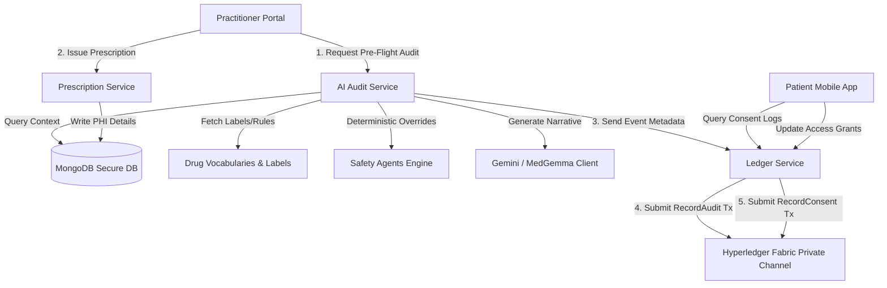
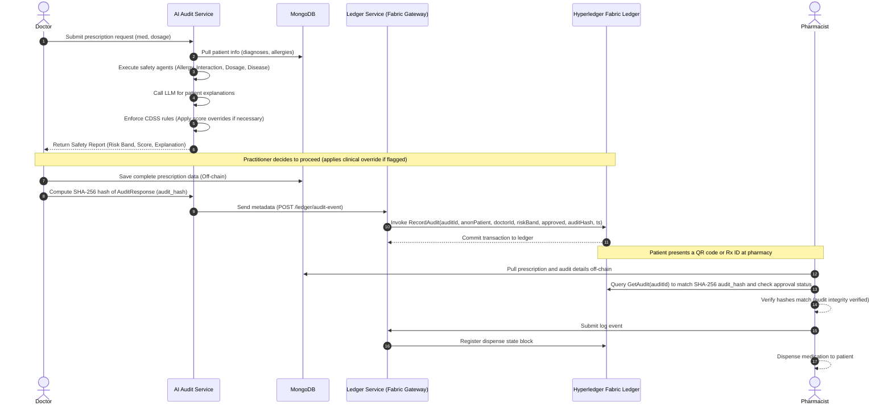

# AegisRx: Privacy-First Clinical Prescription Safety Audit System

AegisRx is a privacy-first clinical prescription safety audit system that combines a deterministic, multi-agent AI safety engine with a permissioned blockchain ledger service (Hyperledger Fabric) and a secure MongoDB backend. 

The primary goal of AegisRx is to evaluate every prescription for clinical safety risks (allergies, drug-drug interactions, appropriate dosages, and organ/disease contraindications) while enforcing patient access consent, ensuring strict privacy of Protected Health Information (PHI), and logging events in an immutable, tamper-evident audit ledger.

---

## 1. System Architecture Overview

The system operates across three primary layers:
1. **Secure Database Layer (MongoDB):** Stores full clinical data off-chain to maintain privacy and comply with HIPAA/GDPR principles.
2. **Deterministic Multi-Agent AI Layer (Audit-Service):** Runs rule-based clinical safety engines alongside LLM verification/explanations.
3. **Ledger-Service & Hyperledger Fabric Layer:** Exposes an API gateway to write anonymized transaction hashes, risk bands, and consent events on a permissioned, tamper-evident network.



---

## 2. AI Audit-Service (Multi-Agent Safety Engine)

The AI core runs inside the [audit-service](../backend-ai/services/audit-service) and is orchestrated by [ai_service.py](../backend-ai/services/audit-service/app/ai/services/ai_service.py). It ingests patient demographics, historical prescriptions, active diagnoses, allergies, and the new medication request to construct a structured [PatientContext](../backend-ai/services/audit-service/app/schemas/patient.py).

### Multi-Drug Checks
The orchestrator supports **Multi-Drug Safety Audits**. If the doctor inputs multiple medications (e.g. `Penicillin, Aspirin`) separated by commas or semicolons on the prescription sheet, the orchestrator splits the strings, aggregates the values, and runs parallel evaluations for all target drugs concurrently.

### Core Components

#### A. Domain-Specific Safety Agents
Five rule-based clinical agents execute safety checks in parallel:
* **Allergy Agent ([allergy_agent.py](../backend-ai/services/audit-service/app/ai/agents/allergy_agent.py)):** Checks prescribed drugs against documented patient allergies and cross-reactive drug classes (e.g., Penicillins, NSAIDs).
* **Disease/Organ Agent ([disease_agent.py](../backend-ai/services/audit-service/app/ai/agents/disease_agent.py)):** Evaluates active diagnoses (e.g., CKD, Liver cirrhosis, pregnancy, diabetes) and flags contraindicated medications using SNOMED/ICD mappings.
* **Dosage Agent ([dosage_agent.py](../backend-ai/services/audit-service/app/ai/agents/dosage_agent.py)):** Validates if prescribed doses, administration frequencies, and therapy durations fall within safe therapeutic ranges based on the patient's age and health status.
* **Interaction Agent ([interaction_agent.py](../backend-ai/services/audit-service/app/ai/agents/interaction_agent.py)):** Scans the active medication list alongside the new prescription to flag drug-drug interactions and duplicate therapeutic classes.
* **Doctor Agent ([doctor_agent.py](../backend-ai/services/audit-service/app/ai/agents/doctor_agent.py)):** Evaluates clinical overrides and logs practitioner justifications for prescribing high-risk items.

#### B. Medical Knowledge Layer
The safety agents pull canonical codes and drug label facts from:
* [rxnorm.py](../backend-ai/services/audit-service/app/ai/knowledge/rxnorm.py) — Normalizes drug names to RXCUIs and retrieves structural dose forms.
* [snomed.py](../backend-ai/services/audit-service/app/ai/knowledge/snomed.py) — Matches clinical terms to standardized medical concepts.
* [dailymed.py](../backend-ai/services/audit-service/app/ai/knowledge/dailymed.py) — Retrieves official drug warning labels, contraindications, and pregnancy classifications.
* [openfda.py](../backend-ai/services/audit-service/app/ai/knowledge/openfda.py) — Queries adverse events databases for age, kidney, and liver-specific risks.
* [drugbank.py](../backend-ai/services/audit-service/app/ai/knowledge/drugbank.py) — Detects verified drug-drug interaction severities.

#### C. Deterministic Risk Scoring & Policy Override
AegisRx enforces a **safe-by-design policy**. The system combines agent results using fixed rules:
* Each agent returns a risk severity: `LOW`, `MEDIUM`, `HIGH`, or `CRITICAL`.
* The overall `risk_band` is determined by the highest severity flagged by any rule-based agent.
* The `risk_score` is deterministically mapped (e.g., `LOW` = 10, `MEDIUM` = 60, `HIGH`/`CRITICAL` = 95+).
* An `override_required` flag is set to `true` if the risk is `HIGH` or `CRITICAL`.

> [!IMPORTANT]
> **LLM Constraint:** The Large Language Model (Gemini or MedGemma) is strictly limited to generating patient-friendly explanations and suggesting alternatives. The LLM has **no authority** to set or modify the numeric risk score or downgrade risk levels. If the LLM generates a lower risk rating than the rule engine, the system overrides it and forces a `CRITICAL` or `WARNING` upgrade.

---

## 3. Off-Chain Secure Data Storage (MongoDB Backend)

To protect patient privacy, raw PHI is strictly isolated from the blockchain layer:
* **Off-Chain Storage:** Full clinical notes, prescription details, list of diagnoses, allergies, and the complete audit JSON payloads reside safely inside encrypted MongoDB collections.
* **Role-Based Access Control (RBAC):** Only authenticated practitioners, pharmacists, and authorized backend microservices can fetch off-chain records via secure backend gateways.
* **Metadata Coupling:** The database records link to on-chain registers using anonymized identifiers (`audit_id`, `patient_id_anon`, and `doctor_id_anon`).

---

## 4. Ledger-Service & Hyperledger Fabric Layer

AegisRx records immutable audit logs and consent metadata on a permissioned, private **Hyperledger Fabric** network.

### A. Fabric Network & Channel Structure
* **Organizations:** The channel connects multiple distinct organization nodes (e.g., Hospital Organization, Pharmacy Organization) and orderers.
* **Channel:** Transactions are broadcast to a private channel (e.g., `aegisrx-audit-channel`) keeping them hidden from unauthorized external entities.
* **Chaincode:** A smart contract `auditlog` is deployed to the channel to manage ledger queries and submissions.

### B. Chaincode Design (`auditlog`)
The smart contract contains functions to enforce rules and access controls:
* `RecordAudit(auditId, patientIdAnon, doctorIdAnon, riskBand, decisionType, auditHash, timestamp)`: Anchors the clinical safety verification event. It registers the audit hash (SHA-256 fingerprint of the `AuditResponse`) to allow verification of off-chain database integrity.
* `GetAudit(auditId)`: Fetches the immutable audit block header to verify audit history.
* `RecordConsent(consentId, patientIdAnon, scope, actionType, timestamp)`: Logs patient-sovereign consent actions (e.g. access grant, access revocation) to provide a tamper-evident consent history trail.

### C. Ledger-Service Responsibilities & API Gateway
The ledger-service handles secure gateway transactions between the backend and Hyperledger Fabric peers using an integrated **Fabric Client SDK Simulation** ([fabric_client.py](../backend-ai/services/ledger-service/app/integrations/fabric_client.py)):
* **Simulated Ledger SDK Client:** In development, the system runs a mock client that signs envelopes and commits transactions to a secure `fabric_blocks` database collection. In production, this maps standard requests to live Fabric peer nodes.
* **REST Endpoints:** Exposes transaction endpoints:
  * `POST /api/ledger/audit-event` - Commits a clinical safety verification hash to the ledger.
  * `POST /api/ledger/consent-event` - Commits patient sovereign access grant/revocation.
  * `GET /api/ledger/audit-event/{audit_id}` - Retrieves the immutable block receipts.
* **Payload Structure:**
  ```json
  {
    "audit_id": "uuid-1234",
    "patient_id": "anon-patient-404",
    "doctor_id": "doc-01",
    "risk_band": "HIGH",
    "decision_type": "approved",
    "audit_hash": "SHA256-of-AuditResponse-JSON",
    "timestamp": "2026-07-15T11:03:00Z"
  }
  ```
* **Fabric Gateway Integration:** Submits standard transactions using the Fabric Gateway SDK and practitioner identities, verifying that no raw PHI (names, specific drug listings, or diagnosis names) is exposed to the ledger.

---

## 5. End-to-End System Workflow



---

## 6. Project Description (Executive Summary)

> **AegisRx** is a privacy-first clinical prescription safety audit system that combines a deterministic multi-agent AI engine with a permissioned blockchain audit trail. The audit-service evaluates each prescription against patient diagnoses, allergies, dosage ranges, and interaction rules using RxNorm and related drug knowledge sources, producing a deterministic risk band and detailed explanation while keeping all PHI encrypted in MongoDB. A separate ledger-service records only de-identified audit and consent metadata — including IDs, risk bands, decision types, hashes, and timestamps — on a Hyperledger Fabric network, giving doctors and patients verifiable, tamper-evident proof of each audit without exposing underlying clinical content. This architecture ensures that doctors and authorized services can access prescription data, while all other parties remain blocked unless consent is granted.
