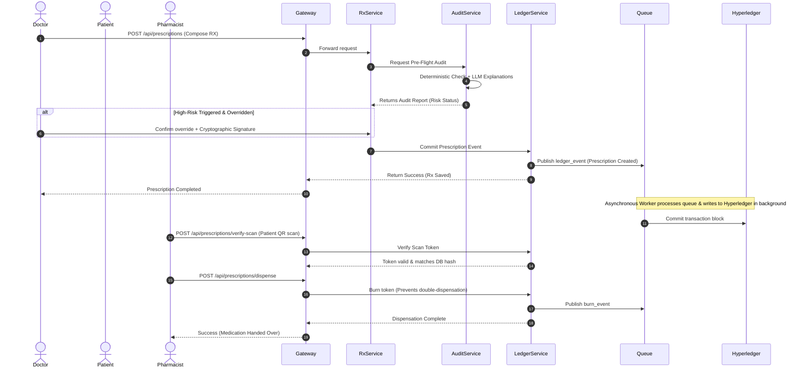

# 🛡️ AegisRx - Architectural Assessment & Production-Ready Plan

This document presents a principal-level architectural evaluation of the current **AegisRx / HealthLock** microservices system. It challenges the current assumptions, validates the clinical safety policies, exposes critical gaps, and presents a production-ready implementation plan.

---

## 1. Complete Architecture Assessment

The AegisRx platform is a **multi-role, microservices-based patient-sovereign health ecosystem**. It consists of a **Flutter Mobile App Client** and **FastAPI Python Backend Services** managed by an API Gateway.

The system uses a **zero-trust clinical design** where prescriptions are cryptographically signed using SHA-256 and verified through an immutable transaction log. The ledger is mirrored onto a permissioned **Hyperledger Fabric** blockchain network to establish a consensus verification system that prevents prescription tampering or double-dispensation at pharmacies. 

The clinical safety checking utilizes a **hybrid multi-agent system**: it runs deterministic clinical rules parallel with an LLM (Gemini or MedGemma) to evaluate drug interactions, duplicates, allergies, and contraindications.

---

## 2. Strengths of the Current System

*   **Failsafe Rule-Based Overrides (Safe-by-Design)**: The [AIService](file:///C:/Users/srima/hackathon%20votexa/health_lock/backend-ai/services/audit-service/app/ai/services/ai_service.py) does not trust the LLM blindly. It executes rule-based clinical safety agents in parallel and overrides the LLM's assessment if the rules detect a critical conflict that the model missed or underreported.
*   **Edge Isolation**: The [Gateway Service](file:///C:/Users/srima/hackathon%20votexa/health_lock/backend-ai/services/gateway-service/app/main.py) isolates all downstream services. Client apps can only access the microservices through the Gateway on port `4000`, hiding internal system topologies.
*   **Cryptographic Prescription Token Integrity**: Prescriptions are signed at the source (the doctor's client) using cryptographic signatures (SHA-256 + hex-shift). This ensures that the prescription data cannot be altered during transit or at the pharmacy counter.
*   **Separation of Concerns**: Microservices are cleanly decoupled under [backend-ai/services/](file:///C:/Users/srima/hackathon%20votexa/health_lock/backend-ai/services) with dedicated endpoints, environments, and requirements.

---

## 3. Weaknesses in the Current System

*   **Copy-Pasted Mock DB Logic**: Every microservice contains an identical copies of [mock_db.py](file:///C:/Users/srima/hackathon%20votexa/health_lock/backend-ai/services/auth-service/app/mock_db.py) (approx. 7.6 KB). This introduces severe code duplication and increases maintenance overhead.
*   **Frontend-to-Backend Schema Divergence**: The Flutter Patient Signup screen collects detailed data (date of birth, gender, country, ID type, ID number, and proof files), but the registration endpoint `auth-service/app/service.py` only takes name, email, and password, silently dropping all clinical demographic variables.
*   **Synchronous Ledger Commits**: The [ledger-service](file:///C:/Users/srima/hackathon%20votexa/health_lock/backend-ai/services/ledger-service/app/integrations/fabric_client.py) performs synchronous calls to the Hyperledger Fabric client wrapper. In production, blockchain network communication latencies can block gateway routing threads and degrade user experience.
*   **In-Memory Fallback State Drift**: When running in mock DB mode, the fallback data resides in-memory on individual service instances. In a distributed multi-replica deployment, this will lead to state divergence where replica A has patient records that replica B does not know about.

---

## 4. Architectural Gaps

*   **No Centralized Shared Utility Library**: The backend lacks a shared internal package for common routines (e.g., cryptographic signature parsing, JWT authentication handlers, MongoDB connection managers).
*   **Absence of a Real Drug Database API**: The clinical rule agents evaluate interactions and class overlaps against static, hardcoded JSON dictionaries in `app/ai/knowledge/`. There is no connection to structured, updated ontologies (e.g., the NIH RxNav/RxNorm API or an internal SQL/NoSQL drug lookup table).
*   **No Distributed Cache**: Frequently requested clinical records, active access permissions, and drug interaction matrices are pulled from DB/mock configurations each time. A caching layer (like Redis) is missing.

---

## 5. Security Gaps

*   **Unvalidated Inter-Service Network Traffic**: Service-to-service calls (e.g., Prescription Service -> Audit Service) are routed over plain, unauthenticated HTTP protocols without TLS/mTLS or authorization tokens.
*   **Insecure Token Storage on Client**: The mobile application utilizes standard, unencrypted SharedPreferences/NSUserDefaults for storing JWT session tokens and private biometric keys, exposing them to side-channel extractions on rooted/jailbroken devices.
*   **Absence of Gateway Token Verification**: The API Gateway blindly forwards incoming requests downstream. It does not validate JWT signature structures or token scopes at the edge.

---

## 6. AI Design Gaps

*   **No Prompt/Model Versioning**: Prompt strings are defined as inline python string templates within `app/ai/llm/prompt_builder.py`. Any updates to prompts require redeploying the entire microservice.
*   **Lack of AI Monitoring & Telemetry**: When the deterministic safety engine overrides an LLM response (or when a doctor explicitly overrides an audit warning), the transaction is completed, but no telemetry event is published to track model drift, false positives, or override patterns.

---

## 7. Component Roadmap Assessment

| Component | Status | Recommendation |
| :--- | :--- | :--- |
| **Gateway Proxy Routing** | ✅ Implemented correctly | Keep unchanged. |
| **Deterministic Rules Overrides** | ✅ Implemented correctly | Keep unchanged; handles LLM hallucinations and latency timeouts. |
| **JWT Local Client Storage** | 🟡 Partially implemented | **Improve**: Migrating from shared preferences to `flutter_secure_storage`. |
| **Patient Registration Schemas** | 🟡 Partially implemented | **Improve**: Aligning backend models with Flutter signup controllers. |
| **Ledger Commits** | 🟡 Partially implemented | **Improve**: Decoupling blockchain writes from REST requests using an asynchronous event queue. |
| **Duplicate mock_db.py Files** | 🔵 Redundant | **Remove**: Centralize fallback data into a shared package or external JSON. |
| **Hardcoded Drug Mock DBs** | 🔵 Redundant | **Remove**: Replace static dictionaries with a centralized local SQLite drug database. |
| **Centralized Shared Core** | 🔴 Missing | **New Component**: A shared Python module for schemas, cryptotools, and DB connectors. |
| **Asynchronous Ledger Queue** | 🔴 Missing | **New Component**: Message broker (RabbitMQ/Redis Streams) for write-aside blockchain logs. |
| **AI Observability Engine** | 🔴 Missing | **New Component**: Telemetry publisher for model evaluation drift and override logging. |

---

## 8. AI Responsibility Validation

*   **LLM Core Duty**: Generating the contextual human-readable explanation of why a drug conflict is dangerous, referencing demographic data, and detailing patient-facing instructions.
*   **Rule Engine Core Duty**: Detecting exact drug-drug conflicts, therapeutic class overlaps, age/gender dosage limits, and allergy matches. *LLMs must never be the primary gatekeeper for these checks due to hallucination risks.*
*   **Knowledge Base Core Duty**: Serving as the definitive source for drug names, synonyms, and therapeutic categories.

---

## 9. Updated Backend Architecture & Communication

The proposed production-ready backend decouples transaction processing, centralizes shared library code, and integrates secure edge validation.

```
                      [ Client Application ]
                                │ (HTTPS + JWT)
                                ▼
                   ┌─────────────────────────┐
                   │  API Gateway (Port 4000)│ (Verifies JWT at Edge)
                   └────────────┬────────────┘
                                │ (Internal Network / Virtual Router)
         ┌──────────────────────┼──────────────────────┬──────────────────────┐
         ▼                      ▼                      ▼                      ▼
┌─────────────────┐    ┌─────────────────┐    ┌─────────────────┐    ┌─────────────────┐
│  Auth-Service   │    │  Patient-Svc    │    │Prescription-Svc │    │  Pharmacy-Svc   │
│  (Port 4001)    │    │  (Port 4002)    │    │  (Port 4004)    │    │  (Port 4006)    │
└────────┬────────┘    └────────┬────────┘    └────────┬────────┘    └────────┬────────┘
         │                      │                      │                      │
         └───────────┬──────────┴──────────┬───────────┘                      │
                     ▼                     ▼ (Internal RPC)                   ▼
             ┌──────────────┐      ┌──────────────┐                  ┌──────────────┐
             │ MongoDB (DB) │      │  Audit-Svc   │                  │  Ledger-Svc  │
             └──────────────┘      │  (Port 4005) │                  │  (Port 4007) │
                                   └──────────────┘                  └──────┬───────┘
                                                                            │ (Publish Event)
                                                                            ▼
                                                                     ┌──────────────┐
                                                                     │ Message Queue│ (RabbitMQ)
                                                                     └──────┬───────┘
                                                                            ▼
                                                                     ┌──────────────┐
                                                                     │ LedgerWorker │ (Async worker)
                                                                     └──────┬───────┘
                                                                            ▼
                                                                     ┌──────────────┐
                                                                     │ Hyperledger  │
                                                                     └──────────────┘
```

---

## 10. Folder Structure Migration

To eliminate code duplication, a `shared_core/` library is introduced. Microservices are kept slim, importing shared modules.

```
health_lock/
├── backend-ai/
│   ├── shared_core/                      # [NEW] Centralized Internal Package
│   │   ├── __init__.py
│   │   ├── database.py                   # Singleton MongoDB client wrapper
│   │   ├── security.py                   # JWT validation & encryption tools
│   │   ├── models/                       # Shared Pydantic models (Patient, Prescription)
│   │   └── mock_db/                      # Centralized mock lists (single source of truth)
│   │
│   ├── services/
│   │   ├── auth-service/
│   │   │   ├── app/
│   │   │   │   ├── main.py
│   │   │   │   ├── router.py
│   │   │   │   └── service.py            # Imports from shared_core
│   │   │   └── Dockerfile
│   │   ├── prescription-service/
│   │   └── ... (other services follow same structure)
│   │
│   ├── docker-compose.yml
│   └── requirements.txt
```

---

## 11. Event Flow: Prescribe-to-Dispense Pipeline



---

## 12. Proposed API Endpoints

### 1. Gateway Edge Auth & Routing
*   `POST /api/patient/register` — Takes expanded fields: DOB, Gender, Country, ID verification data, and files. Routes to `auth-service`.
*   `POST /api/audit` — Evaluates medication safety parameters. Routes to `audit-service`.

### 2. Async Ledger & Verification
*   `POST /api/ledger/transaction` — Accepts transaction updates and publishes them to the task queue. Routes to `ledger-service`.
*   `POST /api/prescriptions/verify-scan` — Takes signature, timestamp, and checks validity. Routes to `pharmacy-service`.

---

## 13. Database Schema Changes

To support the expanded demographic data and asynchronous ledger, we update the collections:

### 1. `patients` Collection
```json
{
  "_id": "ObjectId",
  "patient_id": "string (UUID)",
  "name": "string",
  "email": "string",
  "mobile": "string",
  "dob": "string (ISO-8601)",
  "gender": "string",
  "country": "string",
  "id_type": "string",
  "id_number": "string",
  "verification_file_url": "string (Secure S3/Cloud Storage link)",
  "allergies": ["string"],
  "created_at": "ISODate"
}
```

### 2. `prescriptions` Collection (Added Fields)
```json
{
  "technical_details": {
    "batch_number": "string",
    "expiry_date": "string",
    "touch_signature": "string",
    "delivery_tracking_id": "string"
  },
  "ledger_commit_status": "string (PENDING | SUCCESS | FAILED)",
  "fabric_block_number": "number"
}
```

---

## 14. Implementation Roadmap

### Phase 1: Shared Core & Schema Alignment (Week 1)
*   Extract duplicate mock DB classes, utility functions, and cryptographic routines. Create [shared_core](file:///C:/Users/srima/hackathon%20votexa/health_lock/backend-ai/shared_core).
*   Align Flutter patient registration fields with the `auth-service` database controller inputs.

### Phase 2: Asynchronous Event Ledger (Week 2)
*   Add a local message broker (RabbitMQ or Redis Streams container).
*   Refactor the `ledger-service` to publish transaction entries to the broker. 
*   Implement a background queue worker to write transactions to Hyperledger Fabric, preventing latency locks on FastAPI threads.

### Phase 3: Centralized Edge Validation & Secure Storage (Week 3)
*   Update the API Gateway to pre-verify JWT signatures.
*   Integrate `flutter_secure_storage` inside the Flutter app.
*   Implement real-time network downstate banners in Flutter if the gateway goes offline.

---

## 15. Estimated Development Effort

*   **Phase 1 (Code Deduplication & Alignments)**: 12 Hours. (Low risk, clean-up phase).
*   **Phase 2 (Async Ledger & Worker Setup)**: 24 Hours. (Requires setting up brokers, worker exception strategies).
*   **Phase 3 (Security Hardening & Mobile Store)**: 16 Hours. (Requires native mobile keychain configuration).

---

## 16. Risks and Mitigation Strategies

*   **Risk**: If the Hyperledger Fabric client connection goes offline, background worker queue sizes will build up indefinitely.
    *   **Mitigation**: Implement a local MongoDB buffer. Transactions are retried using exponential backoff up to 5 times. If they fail completely, they are moved to a dead-letter queue (DLQ) and flagged in the doctor/pharmacy panel for manual sync.
*   **Risk**: Introducing the gateway JWT pre-check might block valid users if token expirations drift.
    *   **Mitigation**: Use NTP synchronization on all service containers and the gateway, ensuring server-side time clocks match down to the millisecond.
