# AegisRx — End-to-End System Workflow Map

This document describes the complete screen-to-screen routing and data transaction workflow across the **Patient Portal**, **Doctor Portal**, and **Pharmacy Portal**, showing where databases, API registries, AI checks, and smart contract transactions intersect.

---

## 🗺️ Complete System Flowchart (Mermaid)

```mermaid
flowchart TD
    %% Roles Selection
    Start([App Launch]) --> Onboarding[Onboarding Carousel]
    Onboarding --> RoleSelect{Role Selection Screen}

    %% Patient Portal Flow
    RoleSelect -- "Patient Portal" --> PatientAuth{Account Exists?}
    PatientAuth -- "No" --> PatientSignUp[Patient Sign-Up & Verification]
    PatientSignUp --> PatientLogin[Patient Login / Biometric Setup]
    PatientAuth -- "Yes" --> PatientLogin
    PatientLogin --> PatientDashboard[Patient Dashboard]
    
    %% Patient Options
    PatientDashboard --> ViewMedications[View Active Medications]
    PatientDashboard --> ViewHistory[View Health Vault Ledger]
    PatientDashboard --> GenQR[Generate P2P Access QR Code]
    
    %% Patient Prescription Details (Dispense QR)
    ViewMedications --> RxDetails[Prescription Detail Screen]
    RxDetails --> GenDispenseQR[Generate Dispense QR Code]

    %% Doctor Portal Flow
    RoleSelect -- "Doctor Portal" --> DoctorLogin[Doctor Login - License Input]
    DoctorLogin --> DoctorDashboard[Doctor Search Dashboard]
    DoctorDashboard --> ScanPatient{Scan Patient P2P QR Code?}
    
    %% Scan Connection
    ScanPatient -- "Scan Live QR" --> ViewFinder[MobileScanner Camera Feed]
    ScanPatient -- "Simulate" --> ManualDialog[Custom QR Dialog Input]
    GenQR -.-> |"Scan Target"| ViewFinder
    ViewFinder --> FetchConsent[P2P Connection Handshake]
    ManualDialog --> FetchConsent
    
    %% Doctor Patient Interaction
    FetchConsent --> PatientConsentPending[Patient Receives Notification]
    PatientConsentPending -- "Grant Access" --> LoadMedicalFile[Doctor Views Patient Medical File Screen]
    PatientConsentPending -- "Decline" --> ConnectionReject[Connection Terminated]
    
    %% Prescription Editor
    LoadMedicalFile --> ComposeRx[Compose New Prescription Screen]
    ComposeRx --> InputMeds[Input Medication, Timing, & Duration]
    
    %% Real-time AI Safety Audit Pipeline
    InputMeds --> AIAudit{AI Safety Audit Pipeline}
    AIAudit --> RxNormAPI[1. NIH RxNorm API - Generic Codes]
    AIAudit --> openFDA[2. openFDA API - Side Effects]
    AIAudit --> GeminiCloud[3. Google Gemini 2.5 Flash - Structured Clinical Audit]
    
    %% Audit Results Gating
    RxNormAPI & openFDA & GeminiCloud --> AuditOutput{Audit Result}
    AuditOutput -- "SAFE / LOW RISK" --> SignFlow[Proceed to Sign Screen]
    AuditOutput -- "WARNING / CRITICAL" --> AlertDoctor[Display Contraindication Alert & Safe Alternatives]
    AlertDoctor --> OverrideAction{Doctor Chooses to Override?}
    OverrideAction -- "Yes" --> SignFlow
    OverrideAction -- "No" --> InputMeds

    %% Blockchain Submission
    SignFlow --> SignRx[Confirm & Sign Sovereign Lock]
    SignRx --> Sha256[Generate Deterministic SHA-256 Rx Hash]
    Sha256 --> PolygonSubmit{ALLOW_MOCK_POLYGON_TX?}
    PolygonSubmit -- "false (Production)" --> RealTx[Submit Tx to Polygon Amoy Testnet via Web3]
    PolygonSubmit -- "true (Mock)" --> MockTx[Sign Locally & Return Mock Transaction Hash]
    RealTx & MockTx --> SaveMongo[Save Record to cloud MongoDB Atlas]
    SaveMongo --> ReturnToFile[Return to Patient Medical File - History Updated]

    %% Pharmacy Portal Flow
    RoleSelect -- "Pharmacy Portal" --> PharmacyLogin[Pharmacy Login - Enter License]
    PharmacyLogin --> PharmacyScan[Scan Patient Dispense QR Code]
    GenDispenseQR -.-> |"Scan Target"| PharmacyScan
    PharmacyScan --> VerifyBlockchain[Query Blockchain & Match SHA-256 Hash]
    VerifyBlockchain --> MatchResult{Hash Matches?}
    MatchResult -- "Yes" --> DispenseRx[Dispense: Set isDispensed = true in Mongo & Blockchain]
    MatchResult -- "No" --> BlockDispensation[Block Dispense - Tamper Warning]
    DispenseRx --> Done[Medication Dispensed]
    Done --> UpdatePatientVault[Vault Updated: Prescription moves from 'Active' to 'Dispensed Ledger History']
    UpdatePatientVault --> EndFlow([Process Complete])
```

---

## 🔁 Complete Lifecycle Stages of a Prescription

### 1. The Clinical Consultation Stage
1.  **Doctor Scan:** The Doctor logs in, scans the patient's **P2P Access Handshake QR**, and requests connection permission.
2.  **Consent Approval:** The Patient grants access in the Patient App, allowing the Doctor to view their active allergies, health conditions, and history.
3.  **Prescription Entry:** The Doctor enters the medication name and dosages in the prescription composer.

### 2. The Real-Time AI Audit Stage
As the doctor inputs the medication, the backend **Audit Service** automatically checks:
*   **NIH RxNorm:** normalizes drug names to standard identifier codes (RxCUIs).
*   **openFDA:** retrieves known adverse side effects for the drug.
*   **Google Gemini (2.5 Flash):** evaluates the full patient profile (age, gender, active diseases, and current medications) against the new drug to spot drug-drug interactions or allergies.
*   **Clinician Gate:** If conflicts exist, the UI locks and displays red warnings. The doctor must provide a valid clinical justification override before proceeding.

### 3. The Sovereign Signature & Blockchain Stage
1.  **SHA-256 Hashing:** The backend combines all prescription metadata and override reasons into a single JSON payload and generates a deterministic SHA-256 fingerprint hash.
2.  **On-Chain Record:** The Doctor signs this hash using their private key. The unique transaction registers the **Prescription ID** and **SHA-256 hash** onto the Polygon blockchain ledger.
3.  **Database Storage:** The complete human-readable text is stored in MongoDB Atlas, with the status `isDispensed = false`. The prescription appears as **"Active (Pending)"** in the Patient App.

### 4. The Pharmacy Verification & Dispensing Stage
1.  **Dispense QR:** The patient opens the prescription details screen in their app to generate a secure **Dispense QR Code** (valid for 10 minutes, encoded with a narrow scope).
2.  **Double-Ledger Check:** The pharmacist scans the QR code. The pharmacy desk automatically cross-references:
    *   The database record hash.
    *   The live on-chain smart contract hash.
    *   If they mismatch (meaning database tampering), a red **Tamper Alert** blocks dispensation.
3.  **Ledger Update:** If verified, the pharmacist clicks **"Dispense"**, which updates MongoDB and registers the prescription as `isDispensed = true` on the Polygon ledger.
4.  **Completed State:** The prescription automatically moves from the patient's active screen into their **"Dispensed Ledger History"** to populate active daily medication schedules.
