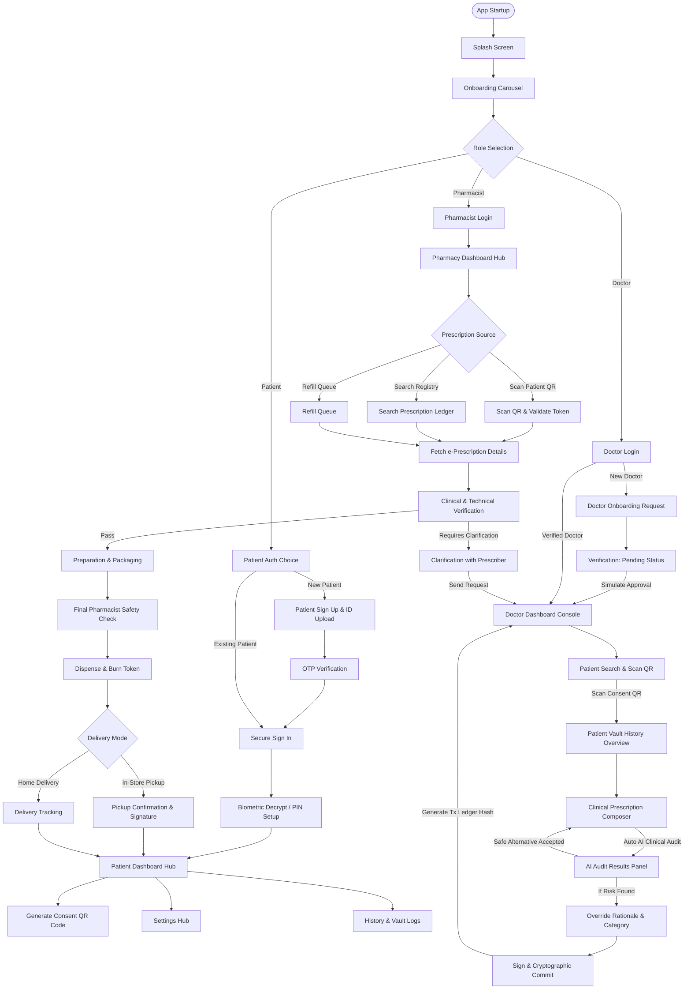

# 🛡️ AegisRx - End-to-End Application Structure, Flows, and Form Registry

This document serves as the comprehensive manual for the **AegisRx (Patient Sovereign Health)** ecosystem. It details the system architecture, directory configurations, runtime sequences, screen-by-screen flows, text fields, and verification ledgers for all three portals: **Patient (Flutter mobile app)**, **Doctor (Web portal / Flutter console)**, and **Pharmacist (Web portal / Flutter console)**.

---

## 1. Unified Flow Diagram

The following flowchart illustrates the startup sequence, role assignment, and inter-portal connections for patients, doctors, and pharmacists.



---

## 2. Common Entry & Role Selection

Before authentication, the application runs a common shell to onboard the user and route them based on their medical role.

### Screens:
1. **Splash Screen (`/splash`)**:
   - Displays the application branding ("AegisRx – Patient Sovereign Health") and a loading indicator.
   - Automatically navigates to the Onboarding Carousel after 2 seconds.
2. **Onboarding Carousel (`/onboarding`)**:
   - 3 interactive slides highlighting core sovereignty principles:
     - Slide 1: **"Your health data is under your control."** (Explains patient-sovereign data privacy).
     - Slide 2: **"Doctors and pharmacies see only what they need."** (Limited, session-based consent sharing).
     - Slide 3: **"AI audits prescriptions for safety."** (AI safety checks checking for allergy/drug interactions).
   - Provides "Next", "Previous", and "Skip" navigation controls.
3. **Role Selection Screen (`/role-selection`)**:
   - High-fidelity selection interface presenting three entry portals:
     - **Patient**: "Manage your prescriptions, risk dashboard, and sharing tokens."
     - **Doctor**: "Review history, run safety audits, and sign prescriptions."
     - **Pharmacist**: "Verify tokens and dispense medications safely."
   - Button: "Continue" (routes user to their selected role's authentication gateway).

---

## 3. Patient Flow Specifications

The Patient Flow governs the registration, biometric key decryption, vault rendering, and consent management.

```
[Role Choice: Patient] ──► [Auth Choice] ──► [Sign Up + ID Upload] ──► [OTP Verification]
                                                                             │
[Dashboard Hub] ◄── [Setup PIN] ◄── [Biometric Decrypt] ◄── [Login Screen] ◄─┘
       │
       ├──► [Generate Consent QR Code] (Live polling loop listens for Doctor request)
       ├──► [Patient Vault History] (Browse past medical encounters and active items)
       └──► [Settings Hub] (Manage biometric settings and server configs)
```

### Screen-by-Screen Walkthrough:
* **Step 1: Patient Auth Choice (`/patient/auth-choice`)**:
  - Option to create a new profile ("I am a new patient") or log in ("I already have an account").
* **Step 2: Patient Registration (`/patient/signup`)**:
  - Collects profile data.
  - Features an **ID Verification Setup**: A dropdown selects the ID Type (e.g., SSN, Aadhaar, NHS) and a text box takes the ID Number.
  - Requires **ID Document Upload Proof**: Interactive file picker simulation that locks registration until a local proof document (e.g., `id_proof_aadhaar.pdf`) is attached and validated.
* **Step 3: Contact OTP Verification (`/patient/verify`)**:
  - Accepts a 6-digit verification code sent to the patient's phone/email (simulated by Cognito/Backend).
* **Step 4: Vault Decryption (`/patient/login`)**:
  - The login screen takes password credentials. Once authenticated, the app prompts for biometric authorization (or local key check) to decrypt the local sovereign health keys.
* **Step 5: Setup Unlock PIN (`/patient/unlock-setup`)**:
  - Set a local 4-to-6 digit PIN bypass so the user can quickly view the app offline and decrypt the vault locally without contacting the remote database.
* **Step 6: Patient Dashboard Hub (`/patient/dashboard`)**:
  - Core navigation hub showing:
    - **DangerBanner**: High-contrast alerts for active conflicts (e.g., *CRITICAL: Patient has a documented Penicillin allergy*).
    - **RiskGauge**: Visual speedometer gauge charting the patient's current clinical safety index (0 to 100).
    - **DoseTimeline**: Timeline tracking Morning, Afternoon, and Night slots.
    - **InventoryTracker**: Progress bar tracking remaining pill stock counts and days left before refill.
    - **ConsultationStatusChip**: Glow chip signaling if the authorization gate is currently `ACTIVE` or `DISCONNECTED`.
* **Step 7: QR Share Consent (`/patient/share`)**:
  - Displays a dynamic QR token containing the patient's identity metadata.
  - Starts a **3-second polling timer** (`GET /api/consultation/pending`) listening for incoming practitioner requests.
  - Shows popup: *"Accept connection from Doctor Priya Sharma?"* Clicking accept establishes the session.
* **Step 8: Patient Settings (`/patient/settings`)**:
  - Profile controls, toggle switch for local biometrics, and a "Sign Out / Lock Vault" button that wipes cached keys from memory.

---

## 4. Doctor Flow Specifications

The Doctor Flow enables practitioners to connect securely to patient profiles, read historical context, compose prescriptions, trigger AI safety pre-flights, and cryptographically sign outputs.

```
[Role Choice: Doctor] ──► [Login] ──► [Onboard Request] ──► [Pending Review Screen]
                                                                   │
[Patient Discovery] ◄── [Dashboard Console] ◄── [Simulate Approval Verification] ◄─┘
       │
       ├──► [Scan Consent QR] ──► [Patient Vault History (Read-Only)]
                                                │
[Sign & Commit] ◄── [Override Form] ◄── [AI Audit Results] ◄── [Composer Editor]
```

### Screen-by-Screen Walkthrough:
* **Step 1: Doctor Onboarding (`/doctor/onboard`)**:
  - Collects medical credentials (License number/NPI, clinic/hospital, and specialties) for manual staff verification.
* **Step 2: Verification Pending (`/doctor/pending`)**:
  - Limits app features. Includes a bypass button: *"Simulate Approval Verification"* which calls the DB controller to flag the doctor as verified, unlocking the dashboard.
* **Step 3: Practitioner Dashboard (`/doctor/dashboard`)**:
  - Displays:
    - Practitioner Details Header (Specialty, clinic).
    - Appointments List (Mock patient appointments: e.g., Priya Sharma, Elena Vance).
    - Active Consultation Card (If connected via QR, shows patient name and an "Open Vault" trigger. If disconnected, shows "No active session").
* **Step 4: Patient Discovery (`/doctor/search`)**:
  - Interactive search bar to query the database, plus a simulated camera viewfinder screen for QR scanning.
  - Tapping *"Simulate QR Scan"* scans the patient token, establishes the session (`POST /api/consultation/request`), and opens the patient's medical history.
* **Step 5: Patient History Review (`/doctor/patient-history`)**:
  - Displays a read-only snapshot of the patient's vault:
    - Allergy tag chips (Red: e.g., Penicillin).
    - Chronic conditions (Teal: e.g., Type-2 Diabetes).
    - Past clinical encounters list.
    - Historical prescriptions (showing risk levels and overrides).
* **Step 6: Clinical Composer & Auto-AI Auditing (`/doctor/compose`)**:
  - Input fields for chief complaints, provisional diagnoses, and clinical notes.
  - **Structured Dynamic Medication Rows**:
    - "Add Row" button inserts a medicine block: Drug name, strength, route dropdown, frequency dropdown, and duration.
    - **Debounced AI Auditing**: Editing any field triggers a 600ms debounced audit (`POST /api/audit`).
    - If a conflict occurs (e.g., prescribing Penicillin to a Penicillin-allergic patient), a warning card is shown with a **Critical Risk (95/100)** score and a list of safe alternatives (e.g., Ciprofloxacin).
    - Tapping *"Apply Alternative"* updates the medicine row, clearing the clinical warning.
* **Step 7: Override & Digital Sign (`/doctor/sign`)**:
  - If risk warnings are left unaddressed (High/Critical risk), the system forces the doctor to fill an **Override Form**:
    - Select Override Category (Clinical judgment, Emergency, Other).
    - Type a text Rationale (mandatory text validation).
    - Acknowledge clinical responsibility checkbox.
  - The doctor signs the document. The backend hashes the prescription payload, signs it using a hex-shift key based on the doctor's NPI, commits it to the ledgers, terminates the patient consent window, and displays the transaction ledger hash (e.g., `0x7a3f89e2c4...`).

---

## 5. Pharmacist Flow Specifications

The Pharmacist Flow verifies token authenticity, audits clinical safety, prepares medications, and records pickup/delivery details.

```
[Role Choice: Pharmacist] ──► [Login] ──► [Dashboard Workload]
                                                 │
[Prescription Detail] ◄── [Scan / Search Ledger] ◄┘
         │
         ├──► [Clarification Form] ──► (Flag issues back to Prescriber)
         │
[Clinical & Technical Verification] ──► [Preparation & Labeling] ──► [Final Safety Check]
                                                                             │
[Ledger Update & Burn Token] ◄── [Pickup Signature / Delivery Tracking] ◄──┘
```

### Screen-by-Screen Walkthrough:
* **Step 1: Pharmacist Login (`/pharmacist/login`)**:
  - Authenticates using username/email and password credentials.
* **Step 2: Workstation Dashboard (`/pharmacist/dashboard`)**:
  - Organizes pharmacist workload:
    - Today's Queue (New prescriptions, Refills due today, On-hold cases).
    - Action Cards: "Scan Patient QR", "Search Registry", "Open Refills".
* **Step 3: Scan / Search Prescription (`/pharmacist/scan` or `/pharmacist/search`)**:
  - The scanning portal processes the patient's checkout QR code.
  - The search screen allows manual entry of the Prescription ID.
  - On identification, it fetches the prescription from the vault.
* **Step 4: Prescription Detail View (`/pharmacist/rx-detail`)**:
  - Read-only dashboard showing patient details (initials, age, allergies), doctor credentials, and medication list.
  - Provides two actions: *"Start verification"* or *"Clarify with prescriber"*.
* **Step 5: Clinical & Technical Verification (`/pharmacist/verify`)**:
  - Split-panel checklists:
    - **Clinical Check Checklist**: "Correct patient matched", "No known allergy conflict", "Dose appropriate", "No drug-drug interaction".
    - **Technical Panel Fields**: Stock availability confirmation, Batch/Lot dropdown, Expiry date selection, Label preview, and Billing authorization status.
* **Step 6: Clarification Form (`/pharmacist/clarify`)**:
  - If verification fails, the pharmacist notes the issue (e.g., dose too high, interaction risk), flags the prescription status as `Awaiting response`, and routes it back to the doctor's dashboard.
* **Step 7: Preparation & Packaging (`/pharmacist/prepare`)**:
  - Details target packaging items. Provides editable fields for prepared counts, select inventory batches, and renders a label review template.
* **Step 8: Final Pharmacist Check (`/pharmacist/final-check`)**:
  - A 4-point safety gateway: "Correct patient name on label", "Correct drug & strength", "Correct quantity", "No damage".
* **Step 9: Dispense & Burn Token (`/pharmacist/dispense`)**:
  - Confirming the dispense event commits the checkout, updates the database status field to `isDispensed = true` (burning the token), and opens the delivery setup.
* **Step 10: Pickup / Delivery (`/pharmacist/pickup` or `/pharmacist/delivery`)**:
  - **In-store Pickup**: Renders a touch signature pad for the patient (or authorized collector) to sign.
  - **Home Delivery**: Accepts courier names and tracking numbers.
  - Both update the patient's vault with timestamped logs.

---

## 6. Comprehensive Text Field Registry

The following table catalogs all input TextFields, dropdowns, and text selectors implemented across the three portals.

| Portal | Screen / Feature | Field Name (Label) | Input Type | Validation & Constraints |
| :--- | :--- | :--- | :--- | :--- |
| **Patient** | **Sign Up** | Full Name * | Text (Capitalized) | Required, cannot be blank |
| **Patient** | **Sign Up** | Mobile number * | Phone | Required, numeric digits only |
| **Patient** | **Sign Up** | Email address | Email Address | Optional, email format checks |
| **Patient** | **Sign Up** | ID Number * | Text | Required, alphanumeric |
| **Patient** | **Sign Up** | Nationality / ID Type * | Dropdown Selector | Required, selection list (Aadhaar, SSN, etc.) |
| **Patient** | **Sign Up** | Upload Document Proof *| File Attachment | Required, block submission until document attached |
| **Patient** | **Sign Up** | Password * | Obscure Text | Required, minimum length criteria |
| **Patient** | **Sign Up** | Confirm Password * | Obscure Text | Required, must match password field |
| **Patient** | **OTP Verification**| Verification Code | Monospace Text | Required, exactly 6 numeric digits |
| **Patient** | **Login** | Mobile number or email *| Text / Phone | Required |
| **Patient** | **Login** | Password * | Obscure Text | Required |
| **Patient** | **PIN Setup** | Enter PIN (4-6 digits) * | Obscure / Numeric | Required, 4-6 digits, matches Confirm field |
| **Patient** | **PIN Setup** | Confirm PIN * | Obscure / Numeric | Required, must match PIN field |
| **Patient** | **Device Unlock** | Enter Passcode | Obscure / Numeric | Required, matches PIN stored in state |
| **Patient** | **Medication List** | Search medications | Text | Query filter (clears on empty search) |
| **Doctor** | **Login** | NPI Number / Identifier *| Text | Required, standard NPI number format |
| **Doctor** | **Login** | Password * | Obscure Text | Required |
| **Doctor** | **Onboard Request** | Full Name * | Text | Required |
| **Doctor** | **Onboard Request** | Medical License / NPI * | Text | Required, registration validation |
| **Doctor** | **Onboard Request** | Hospital / Clinic Name * | Text / Select | Required, queries local branch maps |
| **Doctor** | **Onboard Request** | Specialty * | Dropdown / Select | Required, list of registered specializations |
| **Doctor** | **Onboard Request** | Official Email Address *| Email Address | Required, official domain formatting |
| **Doctor** | **Onboard Request** | Official Phone Number | Phone | Optional |
| **Doctor** | **Patient Search** | Search patient name / ID | Text | Database search query filter |
| **Doctor** | **Composer** | Chief Complaint * | Multi-line Text | Required |
| **Doctor** | **Composer** | Provisional Diagnosis * | Text | Required |
| **Doctor** | **Composer** | Clinical Notes | Multi-line Text | Optional |
| **Doctor** | **Composer Rows** | Drug Name * | Text / Autocomplete | Required, queries database lists |
| **Doctor** | **Composer Rows** | Strength * | Text | Required, (e.g., "500mg", "10ml") |
| **Doctor** | **Composer Rows** | Route * | Dropdown | Required, selection (Oral, IV, IM, Topical) |
| **Doctor** | **Composer Rows** | Frequency * | Dropdown | Required, selection (Once daily, BID, TID, PRN) |
| **Doctor** | **Composer Rows** | Duration Value * | Numeric | Required, duration length digits |
| **Doctor** | **Composer Rows** | Duration Unit * | Dropdown | Required, duration metric (Days, Weeks, Months) |
| **Doctor** | **Override & Sign** | Override Rationale * | Multi-line Text | Required if Risk Score is High/Critical |
| **Doctor** | **Override & Sign** | Override Category * | Dropdown | Required, selection (Clinical judgment, Emergency, etc.) |
| **Pharmacist**| **Login** | Username or email * | Email Address | Required |
| **Pharmacist**| **Login** | Password * | Obscure Text | Required |
| **Pharmacist**| **Registry Search** | Search Patient / Rx ID | Text | Alphanumeric lookup query |
| **Pharmacist**| **Verify Check** | Batch / Lot * | Dropdown Selector | Required, matches active inventory batches |
| **Pharmacist**| **Verify Check** | Expiry Date Selector * | Date Picker | Required, log validation for batch tracking |
| **Pharmacist**| **Clarification** | Describe issue / details *| Multi-line Text | Required when flagging prescription issues |
| **Pharmacist**| **Preparation** | Prep Quantity * | Numeric | Matches against prescribed amount |
| **Pharmacist**| **Pickup Confirm** | Authorized ID Number | Text | Required if drug collected by a proxy agent |
| **Pharmacist**| **Delivery Track** | Delivery Provider * | Dropdown / Text | Required, select carrier (FedEx, local dispatch) |
| **Pharmacist**| **Delivery Track** | Tracking ID * | Text | Required, alphanumeric parcel tracking number |

---

## 7. System Architecture & Databases

AegisRx runs on a zero-trust model combining a modular backend, AI audits, and a dual-ledger storage strategy.

### Codebase Directory Layout:
```
health_lock/
├── lib/                                     # FLUTTER MOBILE APP CORE
│   ├── main.dart                            # Entry, theme configurations, Provider state
│   ├── core/                                # Foundational helper modules
│   │   ├── crypto/crypto_helper.dart        # Hex-shift decryption and signatures
│   │   └── theme/app_theme.dart             # Modern dark aesthetics (60-30-10 rule)
│   ├── features/                            # Feature Modules (Screens & Widgets)
│   │   ├── patient/                         # Vault, onboarding, share, & settings screens
│   │   ├── doctor/                          # Console, composer, AI audit, & signing screens
│   │   └── pharmacy/                        # Login, scan, verification, & dispense screens
│   └── shared/                              # Shared data models & widgets
├── backend-ai/                              # FASTAPI BACKEND SERVER
│   ├── app/
│   │   ├── main.py                          # FastAPI endpoint router registrations
│   │   ├── core/config.py                   # Local config loader and logging
│   │   ├── db/mongodb.py                    # MongoDB database controller singleton
│   │   ├── models/                          # Pydantic data schemas
│   │   ├── routes/                          # REST route endpoint handlers
│   │   ├── services/                        # Business logic modules (signing, ledger, etc.)
│   │   ├── ai/                              # Clinical multi-agent audits
│   │   └── utils/signature.py               # SHA-256 and Hex-Shift cipher keys
│   └── public/                              # MODERN HTML PORTALS
│       ├── doctor-login.html                # Doctor scan interface
│       ├── doctor-prescription.html         # Live prescription composer & audit
│       └── pharmacy-portal.html             # Pharmacist check & dispense log
```

### Core Security & Verification Protocols:
1. **Zero-Trust Access Consent Flow**:
   - Doctors do not have default access to a patient's historical medical records.
   - The patient must generate and show a consent QR code. Clicking accept writes a temporary `ACCESS_GRANT` token to the database.
   - Once the doctor commits the prescription, the backend automatically posts an `ACCESS_REVOKE` event, instantly closing the practitioner's access window.
2. **Cryptographic Signing (Hex-Shift Cipher)**:
   - On submission, the backend converts the prescription JSON data to a canonical string and calculates its SHA-256 hash.
   - It retrieves the doctor's license ID/NPI number to compute a numeric shift offset.
   - It performs a Hex-Shift operation on the hash characters to generate a unique Digital Signature.
   - On dispensing, the pharmacy client fetches the signature, reverses the hex-shift cipher using the doctor's license ID, recalculates the JSON SHA-256 hash, and performs a sweep check: `Computed Hash == Decrypted Signature`. Any discrepancy triggers a tampering warning.
3. **Dual-Ledger Auditing**:
   - Prescriptions are written to two locations:
     - **MongoDB blockchain**: A local, hash-linked database ledger for fast clinical retrieval.
     - **Polygon Web3 Contract**: A public Ethereum-compatible blockchain mapping immutable hashes to prevent tampering.

---

## 8. REST API Reference

The following endpoints coordinate communication between the frontends and services:

* **Authentication & Profiles**:
  - `POST /api/auth/register` — Registers new patients and updates local vault profiles.
  - `POST /api/auth/login` — Authenticates login credentials and decrypts the session.
* **Consultations & Consent**:
  - `POST /api/consultation/request` — Doctor queries consent for patient profile.
  - `GET /api/consultation/pending?patient=<id>` — Patient app polls for incoming connection requests.
  - `POST /api/consultation/accept` — Commits access token to allow file access.
* **Prescriptions**:
  - `GET /api/prescriptions?patient=<id>` — Retrieves patient prescription records.
  - `POST /api/prescriptions` — Computes signature hash, signs, and posts a new prescription record.
  - `GET /api/prescriptions/{rx_id}` — Loads detailed metadata for a specific prescription ID.
  - `POST /api/prescriptions/dispense` — Marks prescription status as dispensed and burns token.
* **AI Safety Checks**:
  - `POST /api/audit` — Evaluates allergies, drug-drug conflicts, and dosage.
  - `GET /api/pattern-analysis/{doctor_id}` — Analyzes prescriber pattern anomalies via IsolationForest.
